# CRM System Architecture & Process Diagrams

## 1. System Architecture Overview

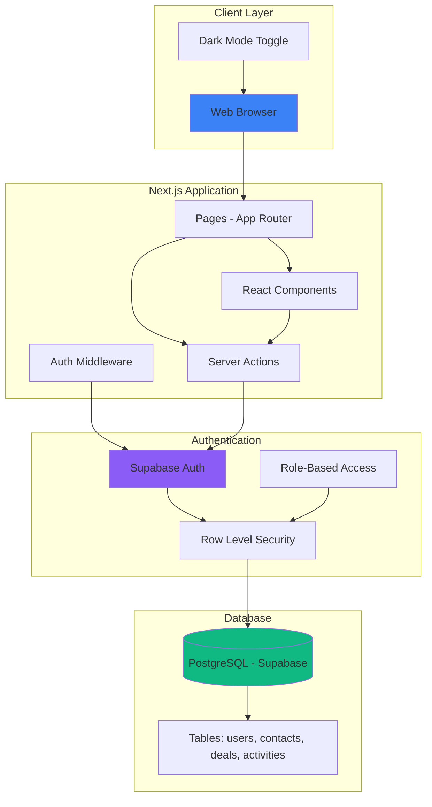

## 2. Database Schema Relationships

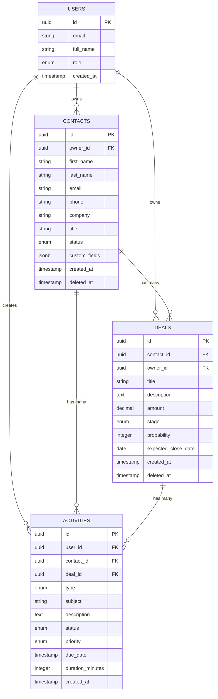

## 3. User Authentication Flow

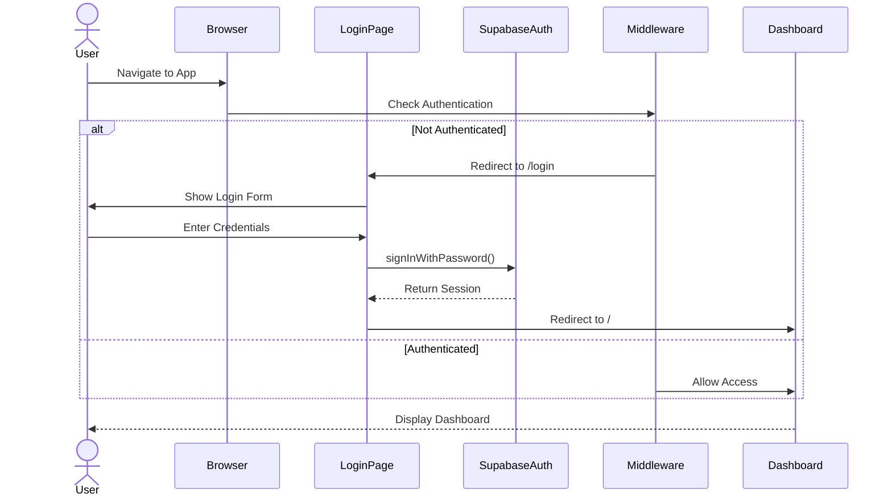

## 4. Contact Management Flow

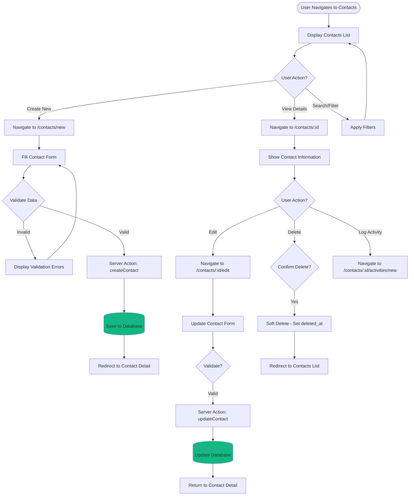

## 5. Deal Pipeline Flow

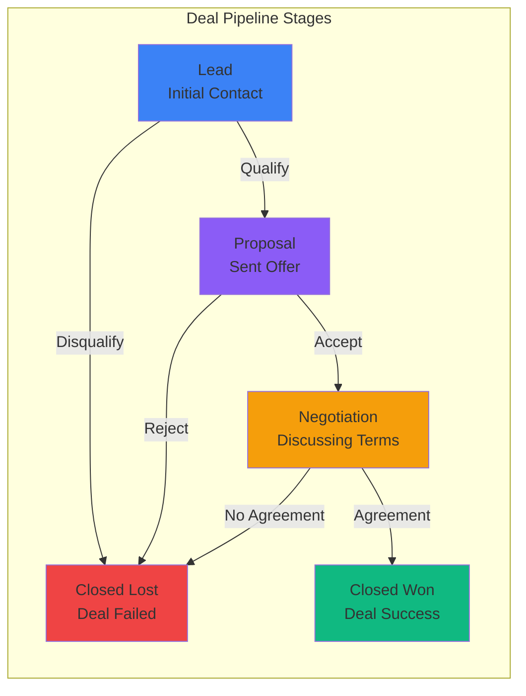

## 6. Activity & Task Management Flow

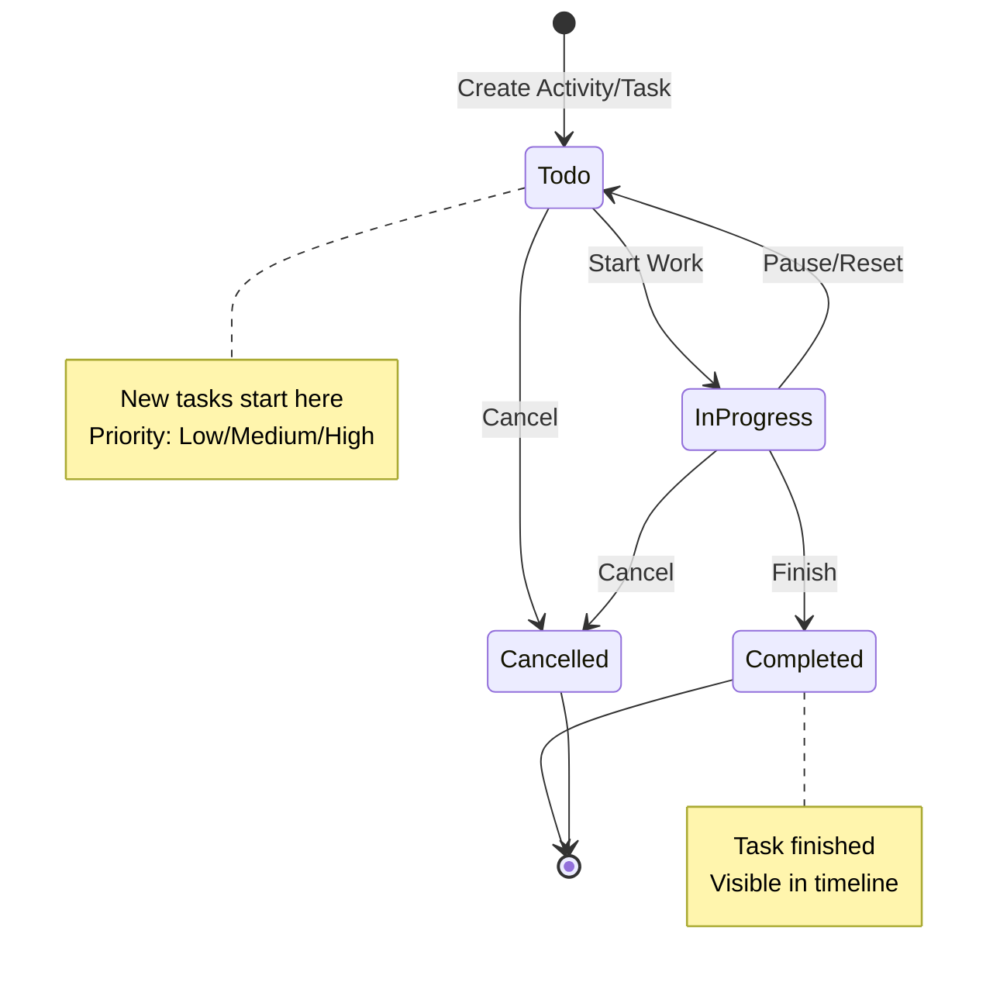

## 7. Complete User Journey - Create Deal with Activity

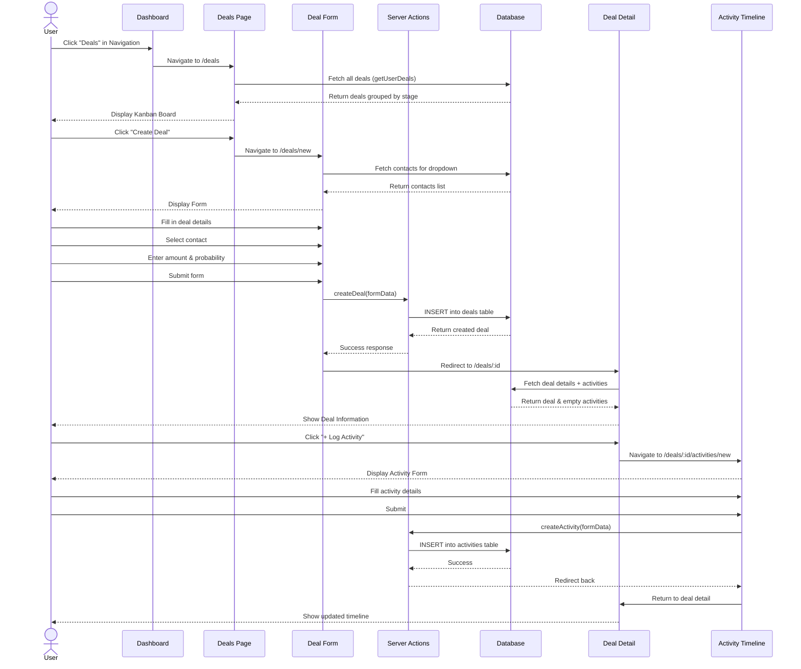

## 8. Permission & Role-Based Access Control

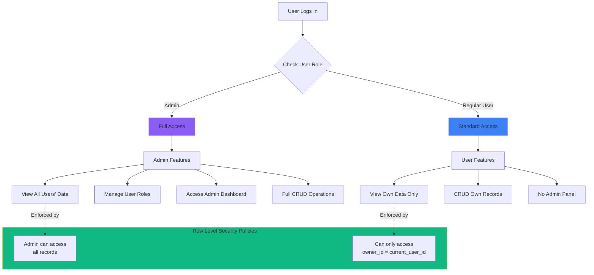

## 9. Dark Mode Implementation

```mermaid
flowchart LR
    User[User Action] --> Toggle[Click Theme Toggle]
    Toggle --> Provider[ThemeProvider Context]

    Provider --> GetCurrent{Current Theme?}
    GetCurrent -->|Light| SetDark[Set Dark Theme]
    GetCurrent -->|Dark| SetLight[Set Light Theme]

    SetDark --> UpdateDOM1[Add 'dark' class to HTML]
    SetLight --> UpdateDOM2[Remove 'dark' class from HTML]

    UpdateDOM1 --> SaveLocal1[Save to localStorage]
    UpdateDOM2 --> SaveLocal2[Save to localStorage]

    SaveLocal1 --> ApplyStyles1[Apply dark: prefixed styles]
    SaveLocal2 --> ApplyStyles2[Apply standard styles]

    subgraph InitialLoad["On Page Load"]
        CheckStorage[Check localStorage] --> HasPreference{Has Saved Theme?}
        HasPreference -->|Yes| LoadSaved[Load Saved Theme]
        HasPreference -->|No| UseSystem[Use System Preference]
    end

    style SetDark fill:#1f2937
    style SetLight fill:#f3f4f6
```

## 10. Tech Stack Overview

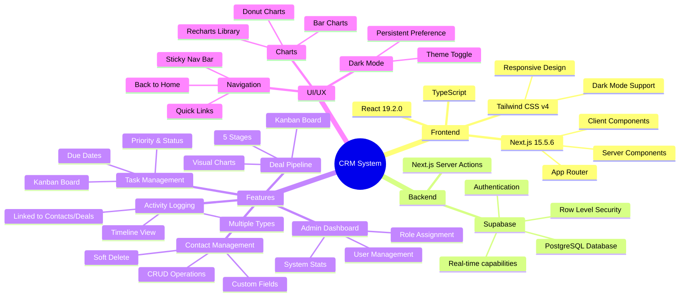

---

## Quick Navigation Map

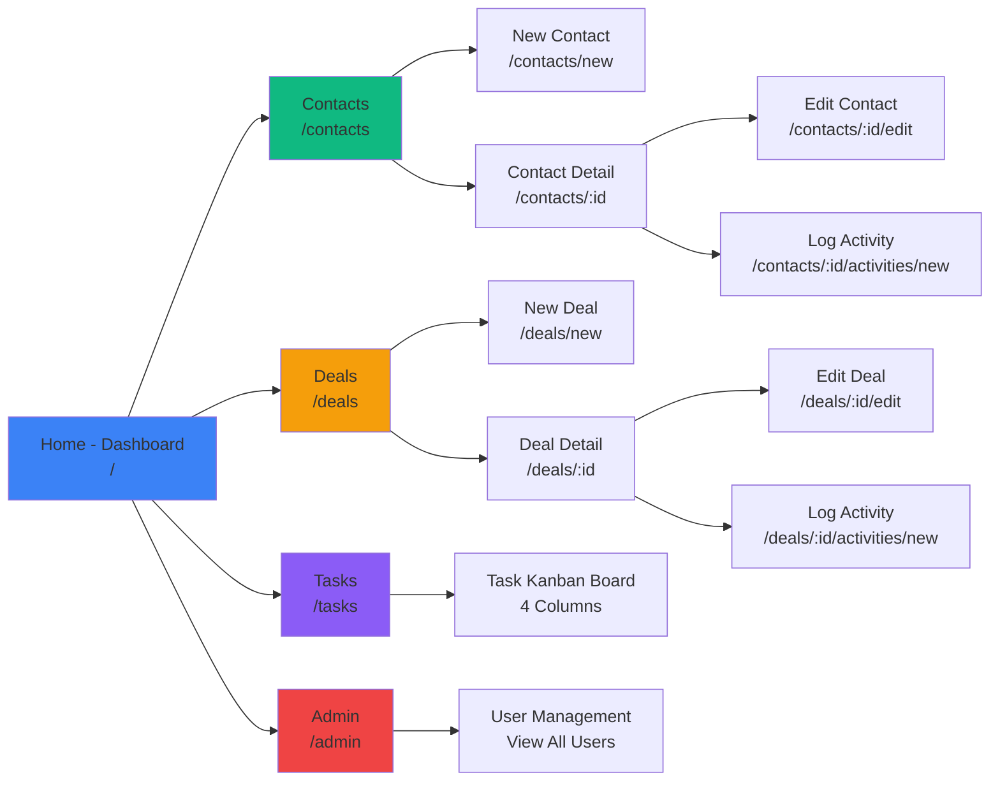
