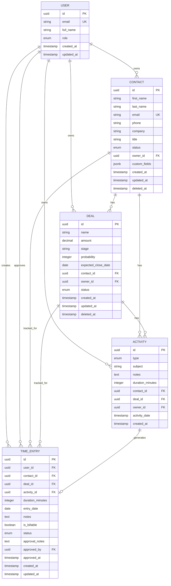
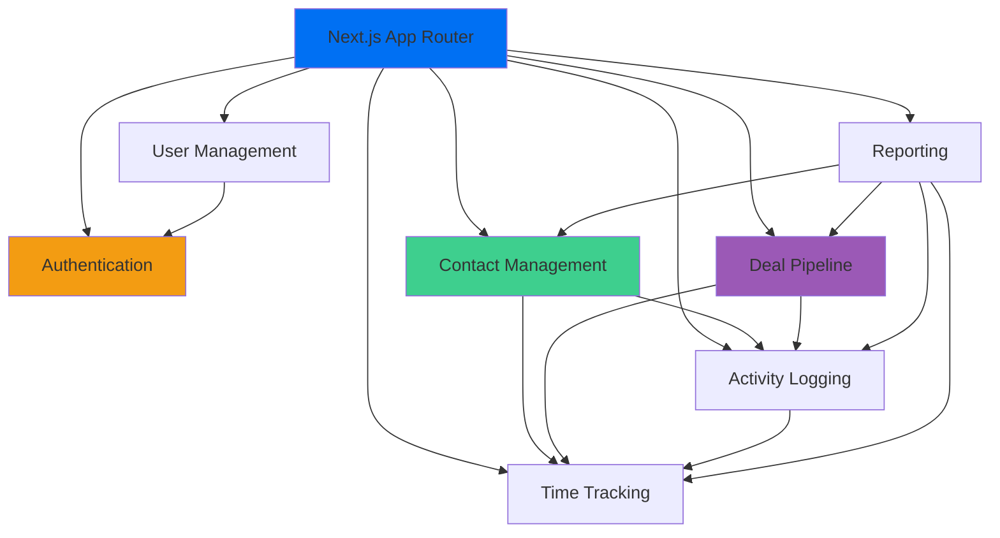
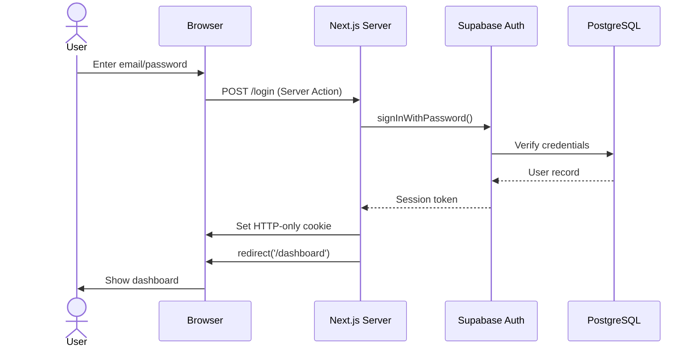
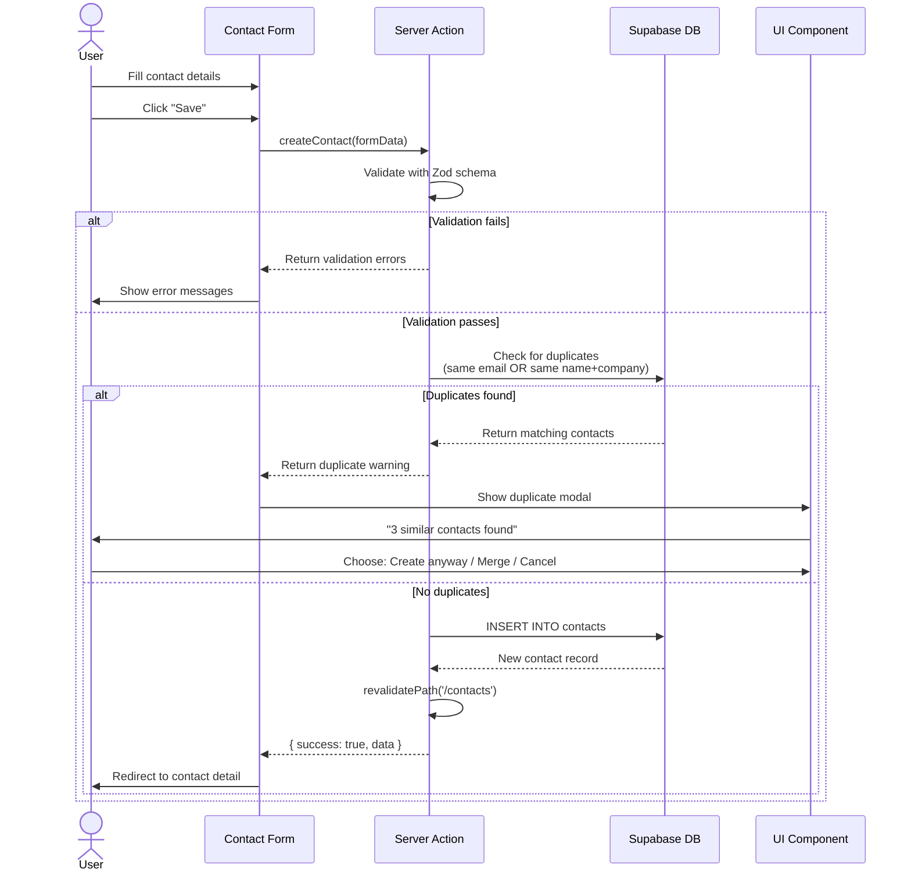
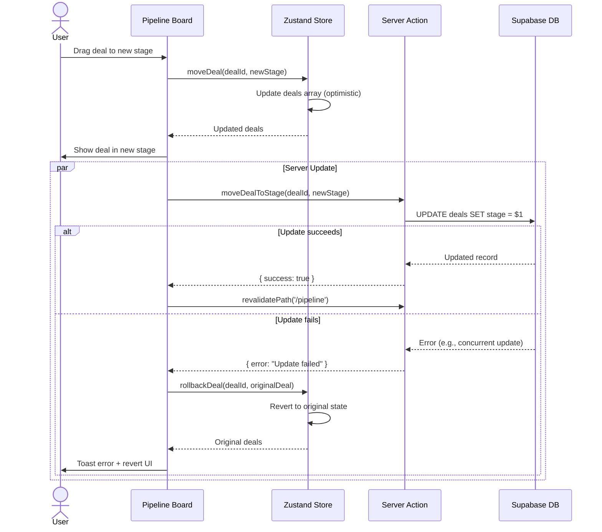
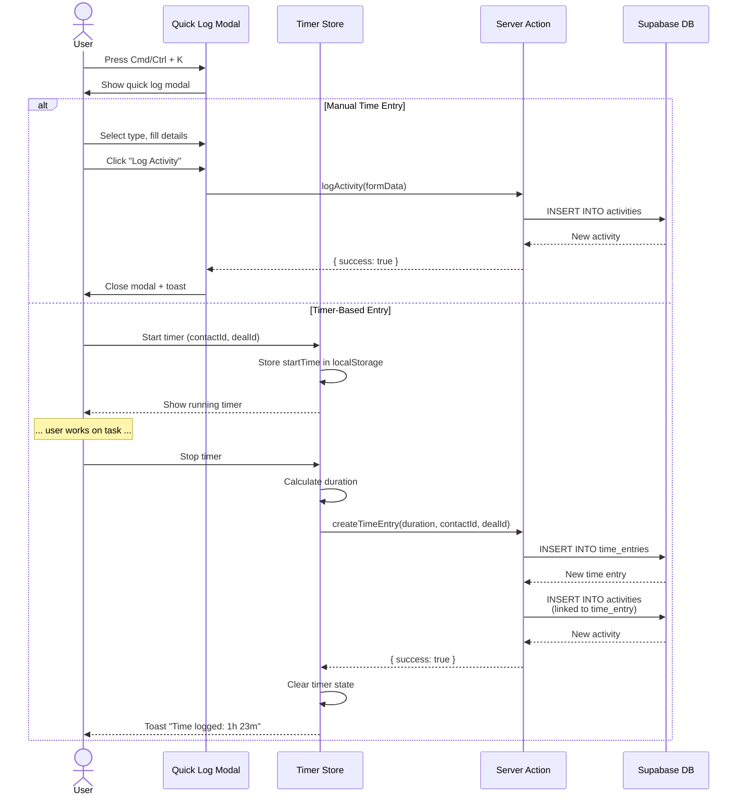
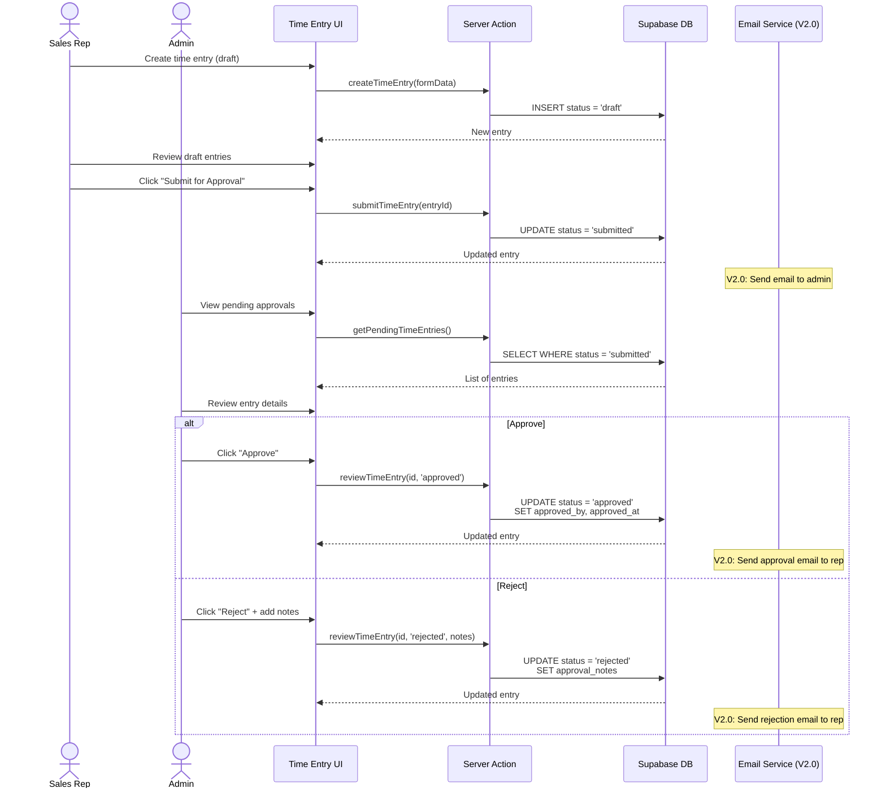
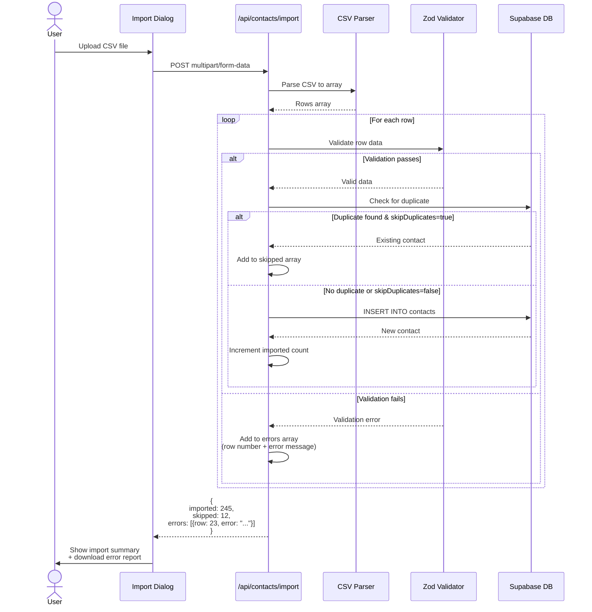

# CRM Application Fullstack Architecture Document

**Version:** 1.0
**Date:** October 21, 2025
**Status:** In Progress
**Author:** Winston (Architect)

---

## Table of Contents

1. [Introduction](#1-introduction)
2. [High Level Architecture](#2-high-level-architecture)
3. [Tech Stack](#3-tech-stack)
4. [Data Models](#4-data-models)
5. [API Specification](#5-api-specification)
6. [Components](#6-components)
7. [External APIs](#7-external-apis)
8. [Core Workflows](#8-core-workflows)
9. [Database Schema](#9-database-schema)
10. [Frontend Architecture](#10-frontend-architecture)
11. [Backend Architecture](#11-backend-architecture)
12. [Unified Project Structure](#12-unified-project-structure)
13. [Development Workflow](#13-development-workflow)
14. [Deployment Architecture](#14-deployment-architecture)
15. [Security and Performance](#15-security-and-performance)
16. [Testing Strategy](#16-testing-strategy)

---

## 1. Introduction

This document outlines the complete fullstack architecture for **CRM Application V1.0 MVP**, including backend systems, frontend implementation, and their integration. It serves as the single source of truth for AI-driven development, ensuring consistency across the entire technology stack.

This unified approach combines what would traditionally be separate backend and frontend architecture documents, streamlining the development process for this modern fullstack Next.js application where these concerns are tightly integrated.

### Starter Template Analysis

Based on the PRD and existing codebase review:

- **Current State:** Minimal Next.js 15 setup with basic structure (app/layout.js, app/page.js)
- **Framework:** Next.js 15.5.6 with App Router (already initialized)
- **Starter Template:** None - greenfield build on minimal Next.js foundation
- **Constraints:** Must use Next.js 15 App Router, Supabase for backend, Vercel for deployment

### Change Log

| Date | Version | Description | Author |
|------|---------|-------------|--------|
| Oct 21, 2025 | 1.0 | Initial architecture document | Winston (Architect) |

---

## 2. High Level Architecture

### Technical Summary

The CRM application follows a **serverless monolith architecture** deployed on Vercel's edge network, leveraging Next.js 15's App Router for both frontend rendering and backend API functionality. The frontend uses React 19 with Tailwind CSS for rapid UI development, while the backend relies on Next.js API Routes and Server Actions for serverless functions. Data persistence is handled by Supabase (PostgreSQL 14) with built-in Row Level Security, authentication via Supabase Auth, and file storage for CSV imports. This architecture achieves the PRD's goals of 5-minute setup, <2s page loads, and support for 500 concurrent users while keeping infrastructure costs under $500/month during beta.

### Platform and Infrastructure Choice

**Selected Platform: Vercel + Supabase**

**Key Services:**
- **Vercel:** Frontend hosting, serverless functions, edge network, CI/CD
- **Supabase:** PostgreSQL database, authentication, Row Level Security, storage
- **Vercel Analytics:** Performance monitoring
- **Supabase Dashboard:** Database monitoring and logs

**Deployment Host and Regions:**
- **Primary Region:** US East (us-east-1) - closest to target market
- **Edge Network:** Global CDN via Vercel Edge
- **Database:** Supabase US East region

### Repository Structure

**Structure:** Monorepo (single repository for frontend + backend)

**Monorepo Tool:** Not needed - Next.js App Router naturally combines frontend and backend in one project

**Package Organization:**
```
/app          - Next.js App Router (frontend pages + API routes)
/components   - React UI components
/lib          - Shared utilities and database client
/types        - TypeScript type definitions (shared across app)
/public       - Static assets
```

**Rationale:** Next.js App Router eliminates the need for separate frontend/backend repos or complex monorepo tooling. Everything lives in one Next.js project with clear separation via directory structure.

### High Level Architecture Diagram

```mermaid
graph TB
    User[User Browser]
    Vercel[Vercel Edge Network]
    NextApp[Next.js App<br/>Frontend + API Routes]
    Supabase[(Supabase<br/>PostgreSQL)]
    SupaAuth[Supabase Auth]
    SupaStorage[Supabase Storage]

    User -->|HTTPS| Vercel
    Vercel -->|Route| NextApp
    NextApp -->|SQL Queries| Supabase
    NextApp -->|Auth Requests| SupaAuth
    NextApp -->|File Upload| SupaStorage
    SupaAuth -.->|Session| User

    style NextApp fill:#0070f3
    style Supabase fill:#3ecf8e
    style Vercel fill:#000
```



### Architectural Patterns

- **Jamstack Architecture:** Static-first with serverless APIs - _Rationale: Optimal performance with CDN caching and edge rendering_
- **Server Components First:** Use React Server Components by default, Client Components only when needed - _Rationale: Reduces JavaScript bundle size and improves initial page load_
- **Server Actions:** Use Next.js Server Actions for mutations instead of API routes - _Rationale: Simplified data flow, automatic revalidation, better DX_
- **Row Level Security (RLS):** Database-level authorization via Supabase RLS policies - _Rationale: Security enforced at data layer, prevents backend bypasses_
- **API Route Pattern:** RESTful API routes for complex operations Server Actions can't handle - _Rationale: Flexibility for CSV imports, external webhooks_
- **Optimistic UI Updates:** Update UI immediately, rollback on error - _Rationale: Perceived performance improvement for user actions_
- **Component Composition:** Small, focused components composed into larger features - _Rationale: Reusability and testability_

---

## 3. Tech Stack

### Technology Stack Table

| Category | Technology | Version | Purpose | Rationale |
|----------|-----------|---------|---------|-----------|
| **Frontend Language** | TypeScript | 5.3+ | Type-safe frontend code | Catches errors at compile time, better IDE support, required for large codebases |
| **Frontend Framework** | Next.js | 15.5.6 | React framework with SSR/SSG | Industry standard for React apps, built-in routing, API routes, excellent performance |
| **UI Library** | React | 19.2.0 | Component-based UI | Comes with Next.js 15, Server Components support, largest ecosystem |
| **UI Component Library** | shadcn/ui | Latest | Pre-built accessible components | Copy-paste components (not npm dependency), Tailwind-based, fully customizable |
| **State Management** | React Context + Zustand | 4.5+ | Client-side state | Context for auth, Zustand for complex UI state, no Redux overhead |
| **Backend Language** | TypeScript | 5.3+ | Type-safe backend code | Share types between frontend/backend, same language across stack |
| **Backend Framework** | Next.js API Routes + Server Actions | 15.5.6 | Serverless backend | Integrated with Next.js, no separate backend needed, automatic type inference |
| **API Style** | Server Actions (primary) + REST (secondary) | N/A | Data mutations and fetching | Server Actions for forms/mutations, REST for CSV uploads and webhooks |
| **Database** | Supabase (PostgreSQL) | 14+ | Relational data storage | Built-in auth, RLS, real-time subscriptions, generous free tier |
| **Cache** | Vercel Edge Cache + React Cache | N/A | Response caching | Vercel handles CDN caching, React cache() for request deduplication |
| **File Storage** | Supabase Storage | N/A | CSV import files | S3-compatible, integrated with Supabase, RLS policies for security |
| **Authentication** | Supabase Auth | N/A | User authentication | Email/password + OAuth, session management, integrated with PostgreSQL |
| **Frontend Testing** | Vitest + React Testing Library | 1.0+ / 14+ | Component unit tests | Faster than Jest, compatible with Vite, best practices for React testing |
| **Backend Testing** | Vitest | 1.0+ | API/Server Action tests | Same tool as frontend, fast execution, TypeScript support |
| **E2E Testing** | Playwright | 1.40+ | Full user journey tests | Official Microsoft tool, multi-browser, debugging tools, fast parallel execution |
| **Build Tool** | Next.js CLI | 15.5.6 | Build and bundle | Built into Next.js, optimized for production builds |
| **Bundler** | Turbopack | Built-in | Fast dev server | Next.js 15 default, 700x faster than Webpack |
| **IaC Tool** | None (Vercel Dashboard) | N/A | Infrastructure management | Vercel handles infra, Supabase dashboard for DB, no Terraform needed for V1.0 |
| **CI/CD** | GitHub Actions | N/A | Automated testing and deployment | Free for public repos, integrates with Vercel, simple YAML configuration |
| **Monitoring** | Vercel Analytics + Supabase Dashboard | N/A | Performance and error tracking | Built-in with platforms, no additional setup, Web Vitals tracking |
| **Logging** | Vercel Logs + Supabase Logs | N/A | Application logs | Platform-provided, searchable, real-time |
| **CSS Framework** | Tailwind CSS | 3.4+ | Utility-first styling | Rapid development, small bundle size, works well with shadcn/ui |
| **Form Handling** | React Hook Form + Zod | 7.49+ / 3.22+ | Form validation | Best performance for React forms, Zod for schema validation, TypeScript inference |
| **Date/Time** | date-fns | 3.0+ | Date manipulation | Lightweight, tree-shakeable, better than moment.js |
| **HTTP Client** | Native fetch + Supabase Client | N/A | API requests | Fetch for REST APIs, Supabase client for database queries |

---

## 4. Data Models

### Core Entities

The CRM application is built around five core entities that represent the domain model. Each entity is defined as a TypeScript interface that maps directly to a PostgreSQL table.

#### 4.1 User

```typescript
interface User {
  id: string                  // UUID primary key
  email: string               // Unique, required
  full_name: string           // Display name
  role: 'admin' | 'user'      // Authorization role
  created_at: string          // ISO 8601 timestamp
  updated_at: string          // ISO 8601 timestamp
}
```

**Relationships:**
- One User owns many Contacts (1:N)
- One User owns many Deals (1:N)
- One User owns many Activities (1:N)
- One User creates many TimeEntries (1:N)
- One User approves many TimeEntries (1:N)

**Business Rules:**
- Email must be unique across all users
- Role defaults to 'user' on creation
- Only admins can manage users
- Soft delete not supported (users are permanent)

#### 4.2 Contact

```typescript
interface Contact {
  id: string                          // UUID primary key
  first_name: string                  // Required
  last_name: string                   // Required
  email: string | null                // Optional, unique if provided
  phone: string | null                // Optional
  company: string | null              // Optional
  title: string | null                // Job title
  status: 'lead' | 'customer'         // Lead qualification status
  owner_id: string                    // FK to User (required)
  custom_fields: Record<string, any> | null  // JSONB for extensibility
  created_at: string                  // ISO 8601 timestamp
  updated_at: string                  // ISO 8601 timestamp
  deleted_at: string | null           // Soft delete timestamp
}
```

**Relationships:**
- Many Contacts belong to one User (N:1)
- One Contact has many Deals (1:N)
- One Contact has many Activities (1:N)
- One Contact has many TimeEntries (1:N)

**Business Rules:**
- Soft delete enabled (deleted_at field)
- Full-text search on first_name, last_name, email, company
- Duplicate detection on create (same email or same name+company)
- Owner cannot be changed after creation
- Custom fields support arbitrary JSON data for future extensibility

#### 4.3 Deal

```typescript
interface Deal {
  id: string                          // UUID primary key
  name: string                        // Deal title (required)
  amount: number                      // Deal value in USD (required)
  stage: string                       // Pipeline stage (required)
  probability: number                 // Win probability 0-100 (required)
  expected_close_date: string         // ISO 8601 date (required)
  contact_id: string | null           // FK to Contact (optional)
  owner_id: string                    // FK to User (required)
  status: 'open' | 'won' | 'lost'     // Deal outcome
  created_at: string                  // ISO 8601 timestamp
  updated_at: string                  // ISO 8601 timestamp
  deleted_at: string | null           // Soft delete timestamp
}
```

**Relationships:**
- Many Deals belong to one Contact (N:1)
- Many Deals belong to one User (N:1)
- One Deal has many Activities (1:N)
- One Deal has many TimeEntries (1:N)

**Business Rules:**
- Soft delete enabled
- Stage must match one of the configured pipeline stages
- Probability must be between 0-100
- Amount must be non-negative
- Status transitions: open → won/lost (no reversals)
- Expected close date cannot be in the past

#### 4.4 Activity

```typescript
interface Activity {
  id: string                                  // UUID primary key
  type: 'call' | 'email' | 'meeting' | 'note' // Activity type
  subject: string | null                      // Activity title
  notes: string | null                        // Activity details
  duration_minutes: number | null             // Length of activity
  contact_id: string | null                   // FK to Contact (optional)
  deal_id: string | null                      // FK to Deal (optional)
  owner_id: string                            // FK to User (required)
  activity_date: string                       // ISO 8601 timestamp
  created_at: string                          // ISO 8601 timestamp
}
```

**Relationships:**
- Many Activities belong to one Contact (N:1)
- Many Activities belong to one Deal (N:1)
- Many Activities belong to one User (N:1)
- One Activity has one TimeEntry (1:1 optional)

**Business Rules:**
- Must be associated with Contact OR Deal (or both)
- Duration required for 'call' and 'meeting' types
- Activity date cannot be in the future
- Notes support markdown formatting
- No soft delete (activities are permanent audit trail)

#### 4.5 TimeEntry

```typescript
interface TimeEntry {
  id: string                                     // UUID primary key
  user_id: string                                // FK to User (required)
  contact_id: string | null                      // FK to Contact (optional)
  deal_id: string | null                         // FK to Deal (optional)
  activity_id: string | null                     // FK to Activity (optional)
  duration_minutes: number                       // Time spent (required)
  entry_date: string                             // ISO 8601 date (required)
  notes: string | null                           // Work description
  is_billable: boolean                           // Billable flag
  status: 'draft' | 'submitted' | 'approved' | 'rejected'
  approval_notes: string | null                  // Approver feedback
  approved_by: string | null                     // FK to User (approver)
  approved_at: string | null                     // ISO 8601 timestamp
  created_at: string                             // ISO 8601 timestamp
  updated_at: string                             // ISO 8601 timestamp
}
```

**Relationships:**
- Many TimeEntries belong to one User (N:1)
- Many TimeEntries belong to one Contact (N:1)
- Many TimeEntries belong to one Deal (N:1)
- Many TimeEntries belong to one Activity (N:1)
- Many TimeEntries are approved by one User (N:1)

**Business Rules:**
- Must be associated with Contact OR Deal OR Activity
- Duration must be positive integer
- Entry date cannot be in the future
- Status transitions: draft → submitted → approved/rejected
- Only admins can approve time entries
- Cannot edit after approval
- is_billable defaults to false

### Entity Relationship Diagram



---

## 5. API Specification

### API Design Philosophy

The CRM application uses a **hybrid API approach** that combines Next.js Server Actions (primary) with REST API Routes (secondary). This design leverages the strengths of both patterns:

- **Server Actions:** Type-safe mutations with automatic revalidation, perfect for form submissions and CRUD operations
- **REST API Routes:** File operations (CSV import/export), webhooks, and third-party integrations

### 5.1 Server Actions API

Server Actions provide the primary interface for data mutations. They are co-located with components and offer automatic TypeScript inference.

#### Authentication Pattern

All Server Actions follow this authentication pattern:

```typescript
'use server'

import { createClient } from '@/lib/supabase/server'
import { revalidatePath } from 'next/cache'

export async function serverAction(params: ActionParams) {
  // 1. Get authenticated user
  const supabase = createClient()
  const { data: { user }, error: authError } = await supabase.auth.getUser()

  if (authError || !user) {
    return { error: 'Unauthorized' }
  }

  // 2. Validate input
  const validated = ActionSchema.safeParse(params)
  if (!validated.success) {
    return { error: 'Validation failed', details: validated.error }
  }

  // 3. Perform action
  const { data, error } = await supabase
    .from('table')
    .insert(validated.data)
    .select()
    .single()

  if (error) {
    return { error: error.message }
  }

  // 4. Revalidate cache
  revalidatePath('/relevant-path')

  // 5. Return success
  return { success: true, data }
}
```

#### Contact Actions

**File:** `app/actions/contacts.ts`

```typescript
// Create Contact
export async function createContact(formData: FormData): Promise<ActionResult<Contact>>

// Update Contact
export async function updateContact(id: string, updates: Partial<Contact>): Promise<ActionResult<Contact>>

// Delete Contact (soft delete)
export async function deleteContact(id: string): Promise<ActionResult<void>>

// Search Contacts
export async function searchContacts(query: string): Promise<ActionResult<Contact[]>>

// Get Contact by ID
export async function getContact(id: string): Promise<ActionResult<Contact>>

// Check for duplicates
export async function checkDuplicateContact(email: string, name: string): Promise<ActionResult<Contact[]>>
```

#### Deal Actions

**File:** `app/actions/deals.ts`

```typescript
// Create Deal
export async function createDeal(formData: FormData): Promise<ActionResult<Deal>>

// Update Deal
export async function updateDeal(id: string, updates: Partial<Deal>): Promise<ActionResult<Deal>>

// Move Deal to Stage (optimistic update)
export async function moveDealToStage(id: string, newStage: string): Promise<ActionResult<Deal>>

// Close Deal (won/lost)
export async function closeDeal(id: string, status: 'won' | 'lost'): Promise<ActionResult<Deal>>

// Delete Deal (soft delete)
export async function deleteDeal(id: string): Promise<ActionResult<void>>

// Get Deals by Stage
export async function getDealsByStage(stage: string): Promise<ActionResult<Deal[]>>
```

#### Activity Actions

**File:** `app/actions/activities.ts`

```typescript
// Log Activity (quick log)
export async function logActivity(formData: FormData): Promise<ActionResult<Activity>>

// Update Activity
export async function updateActivity(id: string, updates: Partial<Activity>): Promise<ActionResult<Activity>>

// Get Activities Timeline
export async function getActivitiesTimeline(
  contactId?: string,
  dealId?: string
): Promise<ActionResult<Activity[]>>

// Delete Activity
export async function deleteActivity(id: string): Promise<ActionResult<void>>
```

#### Time Entry Actions

**File:** `app/actions/time-entries.ts`

```typescript
// Start Timer
export async function startTimer(
  contactId?: string,
  dealId?: string
): Promise<ActionResult<{ timerId: string; startTime: number }>>

// Stop Timer (creates TimeEntry)
export async function stopTimer(timerId: string): Promise<ActionResult<TimeEntry>>

// Create Manual Time Entry
export async function createTimeEntry(formData: FormData): Promise<ActionResult<TimeEntry>>

// Submit Time Entry for Approval
export async function submitTimeEntry(id: string): Promise<ActionResult<TimeEntry>>

// Approve/Reject Time Entry (admin only)
export async function reviewTimeEntry(
  id: string,
  status: 'approved' | 'rejected',
  notes?: string
): Promise<ActionResult<TimeEntry>>

// Get Pending Time Entries (admin)
export async function getPendingTimeEntries(): Promise<ActionResult<TimeEntry[]>>
```

### 5.2 REST API Routes

REST API Routes handle file operations and external integrations.

#### CSV Import API

**Endpoint:** `POST /api/contacts/import`

**Request:**
```typescript
Content-Type: multipart/form-data

{
  file: File  // CSV file
  skipDuplicates: boolean  // Default: true
}
```

**Response:**
```typescript
{
  success: true,
  imported: 245,
  skipped: 12,
  errors: [
    { row: 23, error: "Invalid email format" },
    { row: 67, error: "Missing required field: last_name" }
  ]
}
```

**CSV Format:**
```csv
first_name,last_name,email,phone,company,title,status
John,Doe,john@example.com,555-1234,Acme Corp,CEO,customer
Jane,Smith,jane@example.com,555-5678,Tech Inc,CTO,lead
```

#### CSV Export API

**Endpoint:** `GET /api/contacts/export`

**Query Parameters:**
- `status`: Filter by status (lead|customer)
- `owner_id`: Filter by owner
- `deleted`: Include deleted contacts (default: false)

**Response:**
```typescript
Content-Type: text/csv
Content-Disposition: attachment; filename="contacts-2025-10-21.csv"

first_name,last_name,email,phone,company,title,status,created_at
John,Doe,john@example.com,555-1234,Acme Corp,CEO,customer,2025-10-20T10:30:00Z
...
```

#### Timesheet Export API

**Endpoint:** `GET /api/time-entries/export`

**Query Parameters:**
- `start_date`: ISO 8601 date (required)
- `end_date`: ISO 8601 date (required)
- `user_id`: Filter by user
- `billable_only`: Only billable entries (default: false)

**Response:**
```typescript
Content-Type: text/csv
Content-Disposition: attachment; filename="timesheet-2025-10.csv"

date,user,contact,deal,duration_hours,billable,status,notes
2025-10-20,john@example.com,Acme Corp,Q4 Deal,2.5,true,approved,Client meeting
...
```

### 5.3 API Error Handling

All APIs follow consistent error response format:

```typescript
// Server Action Error
{
  error: string,           // Human-readable message
  details?: ZodError,      // Validation details (if applicable)
  code?: string            // Error code for client handling
}

// REST API Error
{
  error: string,
  code: string,            // ERROR_CODE_CONSTANT
  statusCode: number,      // HTTP status code
  details?: Record<string, any>
}
```

**Common Error Codes:**
- `UNAUTHORIZED` - Not authenticated
- `FORBIDDEN` - Authenticated but not authorized
- `VALIDATION_ERROR` - Input validation failed
- `NOT_FOUND` - Resource not found
- `DUPLICATE` - Unique constraint violation
- `INTERNAL_ERROR` - Unexpected server error

---

## 6. Components

### Component Architecture

The CRM application is organized into seven major functional components, each responsible for a specific domain area. Components follow the Server Components First pattern, using Client Components only when interactivity is required.

#### 6.1 Authentication Component

**Responsibility:** User authentication and session management

**Key Features:**
- Email/password login via Supabase Auth
- OAuth providers (Google, Microsoft - deferred to V2.0)
- Session persistence and refresh
- Protected route middleware
- Role-based access control (Admin/User)

**Implementation:**
```typescript
// app/(auth)/login/page.tsx (Server Component)
export default async function LoginPage() {
  return <LoginForm />
}

// components/auth/login-form.tsx (Client Component)
'use client'
export function LoginForm() {
  const [error, setError] = useState('')

  async function handleSubmit(formData: FormData) {
    const result = await signIn(formData)
    if (result.error) {
      setError(result.error)
    }
  }

  return (
    <form action={handleSubmit}>
      {/* Form fields */}
    </form>
  )
}

// app/actions/auth.ts (Server Action)
'use server'
export async function signIn(formData: FormData) {
  const supabase = createClient()
  const { error } = await supabase.auth.signInWithPassword({
    email: formData.get('email') as string,
    password: formData.get('password') as string,
  })
  
  if (error) {
    return { error: error.message }
  }

  redirect('/dashboard')
}
```

**Middleware Protection:**
```typescript
// middleware.ts
export async function middleware(request: NextRequest) {
  const supabase = createClient()
  const { data: { user } } = await supabase.auth.getUser()

  if (!user && request.nextUrl.pathname.startsWith('/dashboard')) {
    return NextResponse.redirect(new URL('/login', request.url))
  }

  return NextResponse.next()
}

export const config = {
  matcher: ['/dashboard/:path*', '/api/:path*']
}
```

#### 6.2 Contact Management Component

**Responsibility:** CRUD operations for contacts with search and CSV import/export

**Key Features:**
- Contact list with search and filters
- Create/edit contact forms with validation
- Duplicate detection on create
- CSV import with error handling
- CSV export with filters
- Soft delete with confirmation

**Component Structure:**
```
components/contacts/
├── contact-list.tsx           # Server Component (data fetching)
├── contact-search.tsx         # Client Component (interactive search)
├── contact-form.tsx           # Client Component (create/edit form)
├── contact-card.tsx           # Server Component (display)
├── duplicate-warning.tsx      # Client Component (modal)
├── csv-import-dialog.tsx      # Client Component (file upload)
└── csv-export-button.tsx      # Client Component (download trigger)
```

**Search Implementation:**
```typescript
// components/contacts/contact-search.tsx
'use client'
import { useDebouncedCallback } from 'use-debounce'

export function ContactSearch() {
  const router = useRouter()
  const pathname = usePathname()
  const searchParams = useSearchParams()

  const handleSearch = useDebouncedCallback((term: string) => {
    const params = new URLSearchParams(searchParams)
    if (term) {
      params.set('q', term)
    } else {
      params.delete('q')
    }
    router.replace(`${pathname}?${params.toString()}`)
  }, 300)

  return (
    <Input
      placeholder="Search contacts..."
      onChange={(e) => handleSearch(e.target.value)}
      defaultValue={searchParams.get('q') || ''}
    />
  )
}
```

#### 6.3 Deal Pipeline Component

**Responsibility:** Visual Kanban board for deal management with drag-and-drop

**Key Features:**
- Kanban board with pipeline stages (Lead, Qualified, Proposal, Negotiation, Closed Won/Lost)
- Drag-and-drop between stages using @dnd-kit
- Optimistic UI updates with rollback on error
- Deal cards showing amount, probability, close date
- Filter by owner, date range, amount
- Deal detail modal

**Implementation:**
```typescript
// components/deals/pipeline-board.tsx
'use client'
import { DndContext, DragEndEvent } from '@dnd-kit/core'
import { usePipelineStore } from '@/store/pipeline-store'

export function PipelineBoard({ initialDeals }: { initialDeals: Deal[] }) {
  const { deals, moveDeal } = usePipelineStore((state) => ({
    deals: state.deals || initialDeals,
    moveDeal: state.moveDeal,
  }))

  async function handleDragEnd(event: DragEndEvent) {
    const { active, over } = event
    if (!over) return

    const dealId = active.id as string
    const newStage = over.id as string

    // Optimistic update
    moveDeal(dealId, newStage)

    // Server update
    const result = await moveDealToStage(dealId, newStage)
    if (result.error) {
      // Rollback on error
      toast.error(result.error)
      // Store handles rollback internally
    }
  }

  return (
    <DndContext onDragEnd={handleDragEnd}>
      <div className="flex gap-4 overflow-x-auto">
        {PIPELINE_STAGES.map((stage) => (
          <PipelineColumn
            key={stage}
            stage={stage}
            deals={deals.filter((d) => d.stage === stage)}
          />
        ))}
      </div>
    </DndContext>
  )
}
```

**Zustand Store for Optimistic Updates:**
```typescript
// store/pipeline-store.ts
interface PipelineState {
  deals: Deal[]
  draggedDeal: Deal | null
  moveDeal: (dealId: string, newStage: string) => void
  rollbackDeal: (dealId: string, originalDeal: Deal) => void
}

export const usePipelineStore = create<PipelineState>((set, get) => ({
  deals: [],
  draggedDeal: null,
  
  moveDeal: (dealId, newStage) => {
    const { deals } = get()
    const dealIndex = deals.findIndex((d) => d.id === dealId)
    if (dealIndex === -1) return

    const originalDeal = deals[dealIndex]
    const updatedDeals = [...deals]
    updatedDeals[dealIndex] = { ...originalDeal, stage: newStage }

    set({ deals: updatedDeals, draggedDeal: originalDeal })
  },

  rollbackDeal: (dealId, originalDeal) => {
    const { deals } = get()
    const updatedDeals = deals.map((d) =>
      d.id === dealId ? originalDeal : d
    )
    set({ deals: updatedDeals, draggedDeal: null })
  },
}))
```

#### 6.4 Activity Logging Component

**Responsibility:** Quick log for calls, emails, meetings, notes

**Key Features:**
- Quick log modal with keyboard shortcut (Cmd/Ctrl + K)
- Activity type selector (call, email, meeting, note)
- Duration input for calls/meetings
- Auto-link to contact/deal context
- Activity timeline view
- Markdown support for notes

**Implementation:**
```typescript
// components/activities/quick-log-dialog.tsx
'use client'
export function QuickLogDialog() {
  const [open, setOpen] = useState(false)

  useEffect(() => {
    const handleKeyDown = (e: KeyboardEvent) => {
      if ((e.metaKey || e.ctrlKey) && e.key === 'k') {
        e.preventDefault()
        setOpen(true)
      }
    }
    window.addEventListener('keydown', handleKeyDown)
    return () => window.removeEventListener('keydown', handleKeyDown)
  }, [])

  async function handleSubmit(formData: FormData) {
    const result = await logActivity(formData)
    if (result.success) {
      setOpen(false)
      toast.success('Activity logged')
    }
  }

  return (
    <Dialog open={open} onOpenChange={setOpen}>
      <DialogContent>
        <form action={handleSubmit}>
          <Select name="type">
            <SelectItem value="call">Call</SelectItem>
            <SelectItem value="email">Email</SelectItem>
            <SelectItem value="meeting">Meeting</SelectItem>
            <SelectItem value="note">Note</SelectItem>
          </Select>
          {/* Other fields */}
          <Button type="submit">Log Activity</Button>
        </form>
      </DialogContent>
    </Dialog>
  )
}
```

#### 6.5 Time Tracking Component

**Responsibility:** Timer widget and timesheet management

**Key Features:**
- Floating timer widget (start/stop/pause)
- Manual time entry form
- Time approval workflow (draft → submitted → approved/rejected)
- Admin dashboard for pending approvals
- Timesheet export to CSV
- Billable hours tracking

**Implementation:**
```typescript
// components/time-tracking/timer-widget.tsx
'use client'
import { useTimerStore } from '@/store/timer-store'

export function TimerWidget() {
  const { isRunning, startTime, startTimer, stopTimer } = useTimerStore()
  const [elapsed, setElapsed] = useState(0)

  useEffect(() => {
    if (!isRunning || !startTime) return

    const interval = setInterval(() => {
      setElapsed(Date.now() - startTime)
    }, 1000)

    return () => clearInterval(interval)
  }, [isRunning, startTime])

  async function handleStop() {
    const result = await stopTimer()
    if (result.success) {
      toast.success('Time entry created')
    }
  }

  return (
    <div className="fixed bottom-4 right-4 bg-white shadow-lg rounded-lg p-4">
      <div className="text-2xl font-mono">
        {formatDuration(elapsed)}
      </div>
      {isRunning ? (
        <Button onClick={handleStop}>Stop</Button>
      ) : (
        <Button onClick={() => startTimer()}>Start Timer</Button>
      )}
    </div>
  )
}
```

**Zustand Store with LocalStorage Persistence:**
```typescript
// store/timer-store.ts
import { create } from 'zustand'
import { persist } from 'zustand/middleware'

interface TimerState {
  timerId: string | null
  startTime: number | null
  isRunning: boolean
  contactId?: string
  dealId?: string
  startTimer: (contactId?: string, dealId?: string) => void
  stopTimer: () => Promise<void>
}

export const useTimerStore = create<TimerState>()(
  persist(
    (set, get) => ({
      timerId: null,
      startTime: null,
      isRunning: false,

      startTimer: (contactId, dealId) => {
        const timerId = crypto.randomUUID()
        set({
          timerId,
          startTime: Date.now(),
          isRunning: true,
          contactId,
          dealId,
        })
      },

      stopTimer: async () => {
        const { timerId, startTime, contactId, dealId } = get()
        if (!timerId || !startTime) return

        const durationMinutes = Math.floor((Date.now() - startTime) / 60000)

        const result = await createTimeEntry({
          duration_minutes: durationMinutes,
          contact_id: contactId,
          deal_id: dealId,
          entry_date: new Date().toISOString(),
        })

        if (result.success) {
          set({ timerId: null, startTime: null, isRunning: false })
        }
      },
    }),
    {
      name: 'timer-storage', // LocalStorage key
    }
  )
)
```

#### 6.6 Reporting Component

**Responsibility:** Dashboard and reports for sales metrics

**Key Features:**
- Sales pipeline report (deals by stage, total value)
- Activity summary report (calls/emails/meetings by user)
- Win/loss report (conversion rates, avg deal size)
- Time tracking report (billable hours, time by project)
- Chart visualizations using Recharts
- CSV export for all reports

**Implementation:**
```typescript
// app/(dashboard)/reports/pipeline/page.tsx (Server Component)
export default async function PipelineReportPage() {
  const supabase = createClient()
  const { data: deals } = await supabase
    .from('deals')
    .select('*')
    .eq('status', 'open')

  const pipelineData = PIPELINE_STAGES.map((stage) => ({
    stage,
    count: deals.filter((d) => d.stage === stage).length,
    value: deals
      .filter((d) => d.stage === stage)
      .reduce((sum, d) => sum + d.amount, 0),
  }))

  return (
    <div>
      <h1>Pipeline Report</h1>
      <PipelineChart data={pipelineData} />
      <PipelineTable data={pipelineData} />
    </div>
  )
}

// components/reports/pipeline-chart.tsx (Client Component)
'use client'
import { BarChart, Bar, XAxis, YAxis, Tooltip } from 'recharts'

export function PipelineChart({ data }: { data: PipelineData[] }) {
  return (
    <BarChart width={800} height={400} data={data}>
      <XAxis dataKey="stage" />
      <YAxis />
      <Tooltip />
      <Bar dataKey="count" fill="#0070f3" name="Deals" />
      <Bar dataKey="value" fill="#3ecf8e" name="Value ($)" />
    </BarChart>
  )
}
```

#### 6.7 User Management Component

**Responsibility:** Admin-only user management (V1.0 basic, V2.0 advanced)

**Key Features:**
- User list with roles
- Create/edit users (email, name, role)
- Deactivate users (V2.0)
- Audit log (V2.0)

**Implementation:**
```typescript
// app/(dashboard)/admin/users/page.tsx
export default async function UsersPage() {
  const supabase = createClient()
  const { data: { user } } = await supabase.auth.getUser()

  // Authorization check
  const { data: profile } = await supabase
    .from('users')
    .select('role')
    .eq('id', user!.id)
    .single()

  if (profile?.role !== 'admin') {
    redirect('/dashboard')
  }

  const { data: users } = await supabase
    .from('users')
    .select('*')
    .order('created_at', { ascending: false })

  return <UserList users={users} />
}
```

### Component Dependency Diagram



---

## 7. External APIs

### V1.0 MVP: No External API Integrations

For the initial MVP launch, **all external API integrations are intentionally deferred to V2.0+**. This decision accelerates time-to-market and allows validation of core CRM functionality before adding integration complexity.

### Deferred Integrations

| Integration | Target Version | Use Case | Rationale for Deferral |
|-------------|---------------|----------|------------------------|
| Gmail API | V2.0 | Email sync, send from CRM | Complex OAuth flow, requires sync architecture |
| Google Calendar API | V2.0 | Meeting scheduling | Dependency on Gmail integration |
| Microsoft Graph API | V2.0 | Outlook/Calendar sync | Alternative to Google, not needed for MVP validation |
| Slack API | V3.0 | Deal notifications | Nice-to-have, not core workflow |
| Stripe API | V3.0 | Payment tracking | Billing features not in V1.0 scope |
| Zapier API | V3.0 | Workflow automation | Advanced feature, requires stable API first |

### V1.0 Workarounds

Users can manually log email and meeting activities using the Quick Log component (Cmd/Ctrl + K). This provides audit trail without integration complexity.

### V2.0 Integration Architecture Preview

When integrations are added in V2.0, the architecture will follow this pattern:

```typescript
// Future: app/api/integrations/gmail/route.ts
export async function POST(request: Request) {
  const { code } = await request.json()
  
  // Exchange OAuth code for tokens
  const tokens = await exchangeCodeForTokens(code)
  
  // Store tokens in database (encrypted)
  await storeUserTokens(userId, 'gmail', tokens)
  
  // Start background sync job
  await queueSync(userId, 'gmail')
  
  return NextResponse.json({ success: true })
}

// Future: lib/integrations/gmail-sync.ts
export async function syncGmailEmails(userId: string) {
  const tokens = await getUserTokens(userId, 'gmail')
  const gmail = google.gmail({ version: 'v1', auth: tokens })
  
  // Fetch emails since last sync
  const messages = await gmail.users.messages.list({
    userId: 'me',
    q: 'after:1609459200', // Unix timestamp of last sync
  })
  
  // Convert to Activity records
  for (const message of messages.data.messages) {
    const detail = await gmail.users.messages.get({
      userId: 'me',
      id: message.id,
    })
    
    await createActivity({
      type: 'email',
      subject: detail.data.subject,
      notes: detail.data.snippet,
      activity_date: new Date(detail.data.internalDate).toISOString(),
    })
  }
}
```

### Webhook Support (V2.0+)

External integrations will use webhooks for real-time updates:

```typescript
// Future: app/api/webhooks/stripe/route.ts
export async function POST(request: Request) {
  const signature = request.headers.get('stripe-signature')
  const body = await request.text()
  
  // Verify webhook signature
  const event = stripe.webhooks.constructEvent(body, signature, WEBHOOK_SECRET)
  
  // Handle event
  if (event.type === 'payment_intent.succeeded') {
    await updateDealStatus(event.data.object.metadata.deal_id, 'won')
  }
  
  return NextResponse.json({ received: true })
}
```

---

## 8. Core Workflows

### Workflow Diagrams

The following sequence diagrams illustrate the six core workflows of the CRM application, showing the interactions between client, server, and database layers.

#### 8.1 User Authentication Flow



**Key Points:**
- Session tokens stored in HTTP-only cookies (XSS protection)
- Middleware validates session on every protected route request
- Token refresh handled automatically by Supabase client
- Failed login attempts return user-friendly error messages

#### 8.2 Create Contact with Duplicate Detection



**Key Points:**
- Duplicate detection uses fuzzy matching (case-insensitive email, similar name)
- User has final decision on duplicate handling
- Optimistic UI update not used here (data integrity priority)
- Full-text search index enables fast duplicate checks

#### 8.3 Drag-and-Drop Deal Stage Change (Optimistic UI)



**Key Points:**
- Optimistic update provides instant feedback
- Original deal state stored for rollback
- Concurrent updates handled by database timestamps
- Error recovery is transparent to user

#### 8.4 Quick Activity Logging with Auto-Time Tracking



**Key Points:**
- Keyboard shortcut (Cmd/Ctrl + K) for quick access
- Timer persists across browser refreshes (localStorage)
- Activity auto-created when timer stops
- Time entry and activity linked in database

#### 8.5 Time Entry Approval Workflow



**Key Points:**
- State machine: draft → submitted → approved/rejected
- Only admins can approve/reject
- Approved entries are immutable (cannot edit)
- Rejected entries can be revised and resubmitted (V2.0)

#### 8.6 CSV Import with Error Handling



**Key Points:**
- Batch processing with transaction rollback on critical errors
- Partial success allowed (some rows fail, others succeed)
- Error report includes row numbers for easy fixing
- Duplicate detection uses same logic as create form
- Progress indicator for large files (1000+ rows)

### Workflow Summary Table

| Workflow | Pattern | Optimistic UI | Auth Required | Admin Only |
|----------|---------|---------------|---------------|------------|
| User Authentication | Server Action | No | No | No |
| Create Contact | Server Action | No | Yes | No |
| Move Deal Stage | Server Action | Yes | Yes | No |
| Log Activity | Server Action | No | Yes | No |
| Approve Time Entry | Server Action | No | Yes | Yes |
| CSV Import | REST API | No | Yes | No |

---

## 9. Database Schema

### Complete PostgreSQL DDL

The following SQL creates the complete database schema for the CRM application, including tables, indexes, RLS policies, and triggers.

```sql
-- Enable required extensions
CREATE EXTENSION IF NOT EXISTS "uuid-ossp";
CREATE EXTENSION IF NOT EXISTS "pg_trgm"; -- For fuzzy text search

-- ============================================================
-- TABLES
-- ============================================================

-- Users table (extends Supabase auth.users)
CREATE TABLE users (
  id UUID PRIMARY KEY REFERENCES auth.users(id) ON DELETE CASCADE,
  email TEXT NOT NULL UNIQUE,
  full_name TEXT NOT NULL,
  role TEXT NOT NULL DEFAULT 'user' CHECK (role IN ('admin', 'user')),
  created_at TIMESTAMPTZ NOT NULL DEFAULT NOW(),
  updated_at TIMESTAMPTZ NOT NULL DEFAULT NOW()
);

-- Contacts table
CREATE TABLE contacts (
  id UUID PRIMARY KEY DEFAULT uuid_generate_v4(),
  first_name TEXT NOT NULL,
  last_name TEXT NOT NULL,
  email TEXT UNIQUE,
  phone TEXT,
  company TEXT,
  title TEXT,
  status TEXT NOT NULL DEFAULT 'lead' CHECK (status IN ('lead', 'customer')),
  owner_id UUID NOT NULL REFERENCES users(id) ON DELETE CASCADE,
  custom_fields JSONB,
  created_at TIMESTAMPTZ NOT NULL DEFAULT NOW(),
  updated_at TIMESTAMPTZ NOT NULL DEFAULT NOW(),
  deleted_at TIMESTAMPTZ,
  
  CONSTRAINT valid_email CHECK (email ~* '^[A-Za-z0-9._%+-]+@[A-Za-z0-9.-]+\.[A-Z|a-z]{2,}$' OR email IS NULL)
);

-- Deals table
CREATE TABLE deals (
  id UUID PRIMARY KEY DEFAULT uuid_generate_v4(),
  name TEXT NOT NULL,
  amount NUMERIC(12, 2) NOT NULL CHECK (amount >= 0),
  stage TEXT NOT NULL,
  probability INTEGER NOT NULL CHECK (probability >= 0 AND probability <= 100),
  expected_close_date DATE NOT NULL,
  contact_id UUID REFERENCES contacts(id) ON DELETE SET NULL,
  owner_id UUID NOT NULL REFERENCES users(id) ON DELETE CASCADE,
  status TEXT NOT NULL DEFAULT 'open' CHECK (status IN ('open', 'won', 'lost')),
  created_at TIMESTAMPTZ NOT NULL DEFAULT NOW(),
  updated_at TIMESTAMPTZ NOT NULL DEFAULT NOW(),
  deleted_at TIMESTAMPTZ,
  
  CONSTRAINT valid_close_date CHECK (expected_close_date >= CURRENT_DATE OR status != 'open')
);

-- Activities table
CREATE TABLE activities (
  id UUID PRIMARY KEY DEFAULT uuid_generate_v4(),
  type TEXT NOT NULL CHECK (type IN ('call', 'email', 'meeting', 'note')),
  subject TEXT,
  notes TEXT,
  duration_minutes INTEGER CHECK (duration_minutes > 0),
  contact_id UUID REFERENCES contacts(id) ON DELETE CASCADE,
  deal_id UUID REFERENCES deals(id) ON DELETE CASCADE,
  owner_id UUID NOT NULL REFERENCES users(id) ON DELETE CASCADE,
  activity_date TIMESTAMPTZ NOT NULL,
  created_at TIMESTAMPTZ NOT NULL DEFAULT NOW(),
  
  CONSTRAINT valid_activity_date CHECK (activity_date <= NOW()),
  CONSTRAINT valid_duration CHECK (
    (type IN ('call', 'meeting') AND duration_minutes IS NOT NULL) OR
    (type IN ('email', 'note'))
  ),
  CONSTRAINT has_relation CHECK (contact_id IS NOT NULL OR deal_id IS NOT NULL)
);

-- Time entries table
CREATE TABLE time_entries (
  id UUID PRIMARY KEY DEFAULT uuid_generate_v4(),
  user_id UUID NOT NULL REFERENCES users(id) ON DELETE CASCADE,
  contact_id UUID REFERENCES contacts(id) ON DELETE SET NULL,
  deal_id UUID REFERENCES deals(id) ON DELETE SET NULL,
  activity_id UUID REFERENCES activities(id) ON DELETE SET NULL,
  duration_minutes INTEGER NOT NULL CHECK (duration_minutes > 0),
  entry_date DATE NOT NULL,
  notes TEXT,
  is_billable BOOLEAN NOT NULL DEFAULT FALSE,
  status TEXT NOT NULL DEFAULT 'draft' CHECK (status IN ('draft', 'submitted', 'approved', 'rejected')),
  approval_notes TEXT,
  approved_by UUID REFERENCES users(id) ON DELETE SET NULL,
  approved_at TIMESTAMPTZ,
  created_at TIMESTAMPTZ NOT NULL DEFAULT NOW(),
  updated_at TIMESTAMPTZ NOT NULL DEFAULT NOW(),
  
  CONSTRAINT valid_entry_date CHECK (entry_date <= CURRENT_DATE),
  CONSTRAINT has_relation CHECK (contact_id IS NOT NULL OR deal_id IS NOT NULL OR activity_id IS NOT NULL),
  CONSTRAINT approved_requires_approver CHECK (
    (status IN ('approved', 'rejected') AND approved_by IS NOT NULL AND approved_at IS NOT NULL) OR
    (status IN ('draft', 'submitted'))
  )
);

-- ============================================================
-- INDEXES
-- ============================================================

-- Users indexes
CREATE INDEX idx_users_email ON users(email);
CREATE INDEX idx_users_role ON users(role);

-- Contacts indexes
CREATE INDEX idx_contacts_owner ON contacts(owner_id) WHERE deleted_at IS NULL;
CREATE INDEX idx_contacts_status ON contacts(status) WHERE deleted_at IS NULL;
CREATE INDEX idx_contacts_email ON contacts(email) WHERE deleted_at IS NULL;
CREATE INDEX idx_contacts_company ON contacts(company) WHERE deleted_at IS NULL;
CREATE INDEX idx_contacts_search ON contacts USING GIN(
  to_tsvector('english', first_name || ' ' || last_name || ' ' || COALESCE(email, '') || ' ' || COALESCE(company, ''))
);
CREATE INDEX idx_contacts_name_trgm ON contacts USING GIN((first_name || ' ' || last_name) gin_trgm_ops);

-- Deals indexes
CREATE INDEX idx_deals_owner ON deals(owner_id) WHERE deleted_at IS NULL;
CREATE INDEX idx_deals_contact ON deals(contact_id) WHERE deleted_at IS NULL;
CREATE INDEX idx_deals_stage ON deals(stage) WHERE deleted_at IS NULL AND status = 'open';
CREATE INDEX idx_deals_status ON deals(status);
CREATE INDEX idx_deals_close_date ON deals(expected_close_date) WHERE status = 'open';
CREATE INDEX idx_deals_amount ON deals(amount) WHERE deleted_at IS NULL;

-- Activities indexes
CREATE INDEX idx_activities_owner ON activities(owner_id);
CREATE INDEX idx_activities_contact ON activities(contact_id);
CREATE INDEX idx_activities_deal ON activities(deal_id);
CREATE INDEX idx_activities_date ON activities(activity_date DESC);
CREATE INDEX idx_activities_type ON activities(type);
CREATE INDEX idx_activities_timeline ON activities(contact_id, deal_id, activity_date DESC);

-- Time entries indexes
CREATE INDEX idx_time_entries_user ON time_entries(user_id);
CREATE INDEX idx_time_entries_contact ON time_entries(contact_id);
CREATE INDEX idx_time_entries_deal ON time_entries(deal_id);
CREATE INDEX idx_time_entries_activity ON time_entries(activity_id);
CREATE INDEX idx_time_entries_status ON time_entries(status);
CREATE INDEX idx_time_entries_date ON time_entries(entry_date DESC);
CREATE INDEX idx_time_entries_pending ON time_entries(status, created_at) WHERE status = 'submitted';

-- ============================================================
-- ROW LEVEL SECURITY (RLS) POLICIES
-- ============================================================

-- Enable RLS on all tables
ALTER TABLE users ENABLE ROW LEVEL SECURITY;
ALTER TABLE contacts ENABLE ROW LEVEL SECURITY;
ALTER TABLE deals ENABLE ROW LEVEL SECURITY;
ALTER TABLE activities ENABLE ROW LEVEL SECURITY;
ALTER TABLE time_entries ENABLE ROW LEVEL SECURITY;

-- Users policies
CREATE POLICY "Users can view their own record"
  ON users FOR SELECT
  USING (auth.uid() = id);

CREATE POLICY "Admins can view all users"
  ON users FOR SELECT
  USING (
    EXISTS (
      SELECT 1 FROM users
      WHERE id = auth.uid() AND role = 'admin'
    )
  );

-- Contacts policies
CREATE POLICY "Users can view own contacts"
  ON contacts FOR SELECT
  USING (owner_id = auth.uid() AND deleted_at IS NULL);

CREATE POLICY "Users can create own contacts"
  ON contacts FOR INSERT
  WITH CHECK (owner_id = auth.uid());

CREATE POLICY "Users can update own contacts"
  ON contacts FOR UPDATE
  USING (owner_id = auth.uid())
  WITH CHECK (owner_id = auth.uid());

CREATE POLICY "Users can soft delete own contacts"
  ON contacts FOR DELETE
  USING (owner_id = auth.uid());

-- Deals policies
CREATE POLICY "Users can view own deals"
  ON deals FOR SELECT
  USING (owner_id = auth.uid() AND deleted_at IS NULL);

CREATE POLICY "Users can create own deals"
  ON deals FOR INSERT
  WITH CHECK (owner_id = auth.uid());

CREATE POLICY "Users can update own deals"
  ON deals FOR UPDATE
  USING (owner_id = auth.uid())
  WITH CHECK (owner_id = auth.uid());

-- Activities policies
CREATE POLICY "Users can view own activities"
  ON activities FOR SELECT
  USING (owner_id = auth.uid());

CREATE POLICY "Users can create own activities"
  ON activities FOR INSERT
  WITH CHECK (owner_id = auth.uid());

CREATE POLICY "Users can update own activities"
  ON activities FOR UPDATE
  USING (owner_id = auth.uid());

-- Time entries policies
CREATE POLICY "Users can view own time entries"
  ON time_entries FOR SELECT
  USING (user_id = auth.uid());

CREATE POLICY "Admins can view all time entries"
  ON time_entries FOR SELECT
  USING (
    EXISTS (
      SELECT 1 FROM users
      WHERE id = auth.uid() AND role = 'admin'
    )
  );

CREATE POLICY "Users can create own time entries"
  ON time_entries FOR INSERT
  WITH CHECK (user_id = auth.uid());

CREATE POLICY "Users can update own draft time entries"
  ON time_entries FOR UPDATE
  USING (user_id = auth.uid() AND status = 'draft');

CREATE POLICY "Admins can approve/reject time entries"
  ON time_entries FOR UPDATE
  USING (
    EXISTS (
      SELECT 1 FROM users
      WHERE id = auth.uid() AND role = 'admin'
    )
  );

-- ============================================================
-- TRIGGERS
-- ============================================================

-- Updated_at trigger function
CREATE OR REPLACE FUNCTION update_updated_at_column()
RETURNS TRIGGER AS $$
BEGIN
  NEW.updated_at = NOW();
  RETURN NEW;
END;
$$ LANGUAGE plpgsql;

-- Apply updated_at trigger to tables
CREATE TRIGGER set_users_updated_at
  BEFORE UPDATE ON users
  FOR EACH ROW
  EXECUTE FUNCTION update_updated_at_column();

CREATE TRIGGER set_contacts_updated_at
  BEFORE UPDATE ON contacts
  FOR EACH ROW
  EXECUTE FUNCTION update_updated_at_column();

CREATE TRIGGER set_deals_updated_at
  BEFORE UPDATE ON deals
  FOR EACH ROW
  EXECUTE FUNCTION update_updated_at_column();

CREATE TRIGGER set_time_entries_updated_at
  BEFORE UPDATE ON time_entries
  FOR EACH ROW
  EXECUTE FUNCTION update_updated_at_column();

-- ============================================================
-- HELPER FUNCTIONS
-- ============================================================

-- Function to search contacts with fuzzy matching
CREATE OR REPLACE FUNCTION search_contacts(search_query TEXT)
RETURNS TABLE (
  id UUID,
  first_name TEXT,
  last_name TEXT,
  email TEXT,
  company TEXT,
  similarity REAL
) AS $$
BEGIN
  RETURN QUERY
  SELECT 
    c.id,
    c.first_name,
    c.last_name,
    c.email,
    c.company,
    GREATEST(
      similarity(c.first_name || ' ' || c.last_name, search_query),
      similarity(COALESCE(c.email, ''), search_query),
      similarity(COALESCE(c.company, ''), search_query)
    ) AS similarity
  FROM contacts c
  WHERE 
    c.deleted_at IS NULL
    AND (
      c.first_name || ' ' || c.last_name ILIKE '%' || search_query || '%'
      OR c.email ILIKE '%' || search_query || '%'
      OR c.company ILIKE '%' || search_query || '%'
    )
  ORDER BY similarity DESC
  LIMIT 50;
END;
$$ LANGUAGE plpgsql;

-- Function to check for duplicate contacts
CREATE OR REPLACE FUNCTION find_duplicate_contacts(
  p_email TEXT,
  p_first_name TEXT,
  p_last_name TEXT,
  p_company TEXT
)
RETURNS TABLE (
  id UUID,
  first_name TEXT,
  last_name TEXT,
  email TEXT,
  company TEXT,
  match_type TEXT
) AS $$
BEGIN
  RETURN QUERY
  SELECT 
    c.id,
    c.first_name,
    c.last_name,
    c.email,
    c.company,
    CASE
      WHEN c.email = p_email THEN 'email'
      WHEN c.first_name = p_first_name AND c.last_name = p_last_name AND c.company = p_company THEN 'name_company'
      ELSE 'fuzzy'
    END AS match_type
  FROM contacts c
  WHERE 
    c.deleted_at IS NULL
    AND (
      (p_email IS NOT NULL AND c.email = p_email)
      OR (p_company IS NOT NULL AND c.first_name = p_first_name AND c.last_name = p_last_name AND c.company = p_company)
    )
  LIMIT 10;
END;
$$ LANGUAGE plpgsql;
```

### Schema Versioning Strategy

**V1.0 Migration Approach:**
- Manual migrations during development
- Single migration file for initial schema
- Apply via Supabase CLI: `npx supabase db push`

**V2.0+ Migration Strategy:**
- Automated migrations with version tracking
- Migration files named: `YYYYMMDDHHMMSS_description.sql`
- Migration table tracks applied migrations
- Rollback support for failed migrations

---

## 10. Frontend Architecture

### Frontend Organization

The frontend follows Next.js 15 App Router conventions with a clear separation between Server Components (default) and Client Components (interactive).

#### 10.1 Directory Structure

```
app/
├── (auth)/                          # Route group: No dashboard layout
│   ├── login/
│   │   └── page.tsx                 # Login page (Server Component)
│   ├── signup/
│   │   └── page.tsx                 # Signup page (Server Component)
│   └── layout.tsx                   # Minimal auth layout
│
├── (dashboard)/                     # Route group: With sidebar layout
│   ├── dashboard/
│   │   └── page.tsx                 # Dashboard home (Server Component)
│   ├── contacts/
│   │   ├── page.tsx                 # Contact list (Server Component)
│   │   ├── [id]/
│   │   │   ├── page.tsx             # Contact detail (Server Component)
│   │   │   └── edit/
│   │   │       └── page.tsx         # Contact edit form
│   │   └── new/
│   │       └── page.tsx             # Create contact form
│   ├── pipeline/
│   │   └── page.tsx                 # Deal pipeline board
│   ├── reports/
│   │   ├── page.tsx                 # Reports dashboard
│   │   ├── pipeline/
│   │   │   └── page.tsx             # Pipeline report
│   │   ├── activity/
│   │   │   └── page.tsx             # Activity report
│   │   └── time-tracking/
│   │       └── page.tsx             # Time tracking report
│   ├── admin/
│   │   └── users/
│   │       └── page.tsx             # User management (admin only)
│   └── layout.tsx                   # Dashboard layout with sidebar
│
├── actions/                         # Server Actions
│   ├── auth.ts
│   ├── contacts.ts
│   ├── deals.ts
│   ├── activities.ts
│   └── time-entries.ts
│
├── api/                             # REST API Routes
│   ├── contacts/
│   │   ├── import/
│   │   │   └── route.ts             # CSV import endpoint
│   │   └── export/
│   │       └── route.ts             # CSV export endpoint
│   └── time-entries/
│       └── export/
│           └── route.ts             # Timesheet export
│
├── layout.tsx                       # Root layout
├── page.tsx                         # Landing page
└── globals.css                      # Global styles

components/
├── ui/                              # shadcn/ui primitives
│   ├── button.tsx
│   ├── input.tsx
│   ├── dialog.tsx
│   ├── select.tsx
│   ├── table.tsx
│   └── ... (other primitives)
│
├── auth/
│   ├── login-form.tsx               # Client Component
│   └── signup-form.tsx              # Client Component
│
├── contacts/
│   ├── contact-list.tsx             # Server Component
│   ├── contact-search.tsx           # Client Component
│   ├── contact-form.tsx             # Client Component
│   ├── contact-card.tsx             # Server Component
│   ├── duplicate-warning.tsx        # Client Component
│   ├── csv-import-dialog.tsx        # Client Component
│   └── csv-export-button.tsx        # Client Component
│
├── deals/
│   ├── pipeline-board.tsx           # Client Component
│   ├── pipeline-column.tsx          # Client Component
│   ├── deal-card.tsx                # Client Component
│   ├── deal-form.tsx                # Client Component
│   └── deal-detail-modal.tsx        # Client Component
│
├── activities/
│   ├── quick-log-dialog.tsx         # Client Component
│   ├── activity-timeline.tsx        # Server Component
│   └── activity-card.tsx            # Server Component
│
├── time-tracking/
│   ├── timer-widget.tsx             # Client Component
│   ├── time-entry-form.tsx          # Client Component
│   ├── approval-dashboard.tsx       # Server Component
│   └── timesheet-table.tsx          # Server Component
│
├── reports/
│   ├── pipeline-chart.tsx           # Client Component
│   ├── activity-chart.tsx           # Client Component
│   └── time-tracking-chart.tsx      # Client Component
│
└── layout/
    ├── sidebar.tsx                  # Client Component
    ├── header.tsx                   # Server Component
    └── mobile-nav.tsx               # Client Component

lib/
├── supabase/
│   ├── client.ts                    # Client-side Supabase client
│   └── server.ts                    # Server-side Supabase client
├── utils.ts                         # Utility functions
├── validations.ts                   # Zod schemas
└── constants.ts                     # App constants

store/
├── pipeline-store.ts                # Zustand: Deal pipeline state
├── timer-store.ts                   # Zustand: Timer state (persisted)
└── auth-store.ts                    # Zustand: Client-side auth state

types/
├── database.ts                      # Generated from Supabase
├── entities.ts                      # Business entity types
└── api.ts                           # API response types
```

#### 10.2 State Management Strategy

**Server State (Data from Database):**
- Fetched in Server Components
- Passed to Client Components as props
- Revalidated via `revalidatePath()` after mutations
- No client-side caching (rely on React cache())

**UI State (Local Component State):**
- Managed with React `useState` for simple cases
- Zustand for complex cross-component state
- No Redux (unnecessary overhead for this app)

**Global State (Zustand Stores):**

```typescript
// store/pipeline-store.ts
interface PipelineState {
  deals: Deal[]
  draggedDeal: Deal | null
  moveDeal: (dealId: string, newStage: string) => void
  rollbackDeal: (dealId: string, originalDeal: Deal) => void
  setDeals: (deals: Deal[]) => void
}

export const usePipelineStore = create<PipelineState>((set, get) => ({
  deals: [],
  draggedDeal: null,
  
  setDeals: (deals) => set({ deals }),
  
  moveDeal: (dealId, newStage) => {
    const { deals } = get()
    const dealIndex = deals.findIndex((d) => d.id === dealId)
    if (dealIndex === -1) return

    const originalDeal = deals[dealIndex]
    const updatedDeals = [...deals]
    updatedDeals[dealIndex] = { ...originalDeal, stage: newStage }

    set({ deals: updatedDeals, draggedDeal: originalDeal })
  },

  rollbackDeal: (dealId, originalDeal) => {
    const { deals } = get()
    const updatedDeals = deals.map((d) =>
      d.id === dealId ? originalDeal : d
    )
    set({ deals: updatedDeals, draggedDeal: null })
  },
}))

// store/timer-store.ts (with localStorage persistence)
interface TimerState {
  timerId: string | null
  startTime: number | null
  isRunning: boolean
  contactId?: string
  dealId?: string
  startTimer: (contactId?: string, dealId?: string) => void
  stopTimer: () => Promise<void>
}

export const useTimerStore = create<TimerState>()(
  persist(
    (set, get) => ({
      timerId: null,
      startTime: null,
      isRunning: false,

      startTimer: (contactId, dealId) => {
        set({
          timerId: crypto.randomUUID(),
          startTime: Date.now(),
          isRunning: true,
          contactId,
          dealId,
        })
      },

      stopTimer: async () => {
        const { startTime, contactId, dealId } = get()
        if (!startTime) return

        const durationMinutes = Math.floor((Date.now() - startTime) / 60000)
        await createTimeEntry({ duration_minutes: durationMinutes, contact_id: contactId, deal_id: dealId })

        set({ timerId: null, startTime: null, isRunning: false })
      },
    }),
    {
      name: 'timer-storage',
    }
  )
)
```

#### 10.3 Routing Strategy

**App Router Patterns:**
- Route groups for layout variations: `(auth)`, `(dashboard)`
- Dynamic routes for detail pages: `contacts/[id]/page.tsx`
- Parallel routes for modals (V2.0): `@modal/(.)contacts/[id]`
- Intercepting routes for quick views (V2.0)

**Navigation:**
- Server-side redirects via `redirect()` from `next/navigation`
- Client-side navigation via `useRouter()` hook
- Programmatic navigation after mutations
- Back button support via browser history

**URL State Management:**
```typescript
// Search params for filters (server-side)
export default async function ContactsPage({
  searchParams,
}: {
  searchParams: { q?: string; status?: string }
}) {
  const { q, status } = searchParams
  
  const supabase = createClient()
  let query = supabase.from('contacts').select('*')
  
  if (q) {
    query = query.or(`first_name.ilike.%${q}%,last_name.ilike.%${q}%,email.ilike.%${q}%`)
  }
  if (status) {
    query = query.eq('status', status)
  }
  
  const { data: contacts } = await query
  return <ContactList contacts={contacts} />
}

// Client-side search param updates
'use client'
export function ContactSearch() {
  const router = useRouter()
  const pathname = usePathname()
  const searchParams = useSearchParams()

  const handleSearch = useDebouncedCallback((term: string) => {
    const params = new URLSearchParams(searchParams)
    if (term) {
      params.set('q', term)
    } else {
      params.delete('q')
    }
    router.replace(`${pathname}?${params.toString()}`)
  }, 300)

  return <Input onChange={(e) => handleSearch(e.target.value)} />
}
```

#### 10.4 Component Composition Patterns

**Server Component First:**
```typescript
// app/(dashboard)/contacts/page.tsx (Server Component)
export default async function ContactsPage() {
  const contacts = await getContacts() // Direct DB fetch
  
  return (
    <div>
      <ContactSearch /> {/* Client Component for interactivity */}
      <ContactList contacts={contacts} /> {/* Server Component for display */}
    </div>
  )
}

// components/contacts/contact-list.tsx (Server Component)
export function ContactList({ contacts }: { contacts: Contact[] }) {
  return (
    <div className="grid gap-4">
      {contacts.map((contact) => (
        <ContactCard key={contact.id} contact={contact} /> {/* Server Component */}
      ))}
    </div>
  )
}
```

**Client Component When Needed:**
```typescript
// components/contacts/contact-search.tsx (Client Component)
'use client'
import { useState } from 'react'

export function ContactSearch() {
  const [query, setQuery] = useState('')
  
  return (
    <Input
      value={query}
      onChange={(e) => setQuery(e.target.value)}
      placeholder="Search contacts..."
    />
  )
}
```

**Optimistic Updates Pattern:**
```typescript
'use client'
export function DealCard({ deal }: { deal: Deal }) {
  const [optimisticStage, setOptimisticStage] = useState(deal.stage)

  async function handleStageChange(newStage: string) {
    // Optimistic update
    setOptimisticStage(newStage)

    // Server update
    const result = await moveDealToStage(deal.id, newStage)
    if (result.error) {
      // Rollback on error
      setOptimisticStage(deal.stage)
      toast.error(result.error)
    }
  }

  return <DealCardUI stage={optimisticStage} onStageChange={handleStageChange} />
}
```

#### 10.5 Form Handling

All forms use React Hook Form + Zod for validation:

```typescript
// components/contacts/contact-form.tsx
'use client'
import { useForm } from 'react-hook-form'
import { zodResolver } from '@hookform/resolvers/zod'
import { CreateContactSchema } from '@/lib/validations'

export function ContactForm() {
  const form = useForm({
    resolver: zodResolver(CreateContactSchema),
    defaultValues: {
      first_name: '',
      last_name: '',
      email: '',
      phone: '',
      company: '',
      status: 'lead',
    },
  })

  async function onSubmit(data: z.infer<typeof CreateContactSchema>) {
    const result = await createContact(data)
    if (result.error) {
      toast.error(result.error)
    } else {
      toast.success('Contact created')
      router.push(`/contacts/${result.data.id}`)
    }
  }

  return (
    <Form {...form}>
      <form onSubmit={form.handleSubmit(onSubmit)}>
        <FormField
          control={form.control}
          name="first_name"
          render={({ field }) => (
            <FormItem>
              <FormLabel>First Name</FormLabel>
              <FormControl>
                <Input {...field} />
              </FormControl>
              <FormMessage />
            </FormItem>
          )}
        />
        {/* Other fields */}
        <Button type="submit">Create Contact</Button>
      </form>
    </Form>
  )
}
```

---

## 11. Backend Architecture

### Backend Organization

The backend is fully integrated with Next.js, using Server Actions as the primary API and REST routes for file operations.

#### 11.1 Server Actions Structure

```
app/actions/
├── auth.ts                 # Authentication actions
├── contacts.ts             # Contact CRUD actions
├── deals.ts                # Deal CRUD actions
├── activities.ts           # Activity logging actions
└── time-entries.ts         # Time tracking actions
```

**Example Server Action:**

```typescript
// app/actions/contacts.ts
'use server'

import { createClient } from '@/lib/supabase/server'
import { revalidatePath } from 'next/cache'
import { z } from 'zod'

const CreateContactSchema = z.object({
  first_name: z.string().min(1, 'First name required'),
  last_name: z.string().min(1, 'Last name required'),
  email: z.string().email().optional().or(z.literal('')),
  phone: z.string().optional(),
  company: z.string().optional(),
  title: z.string().optional(),
  status: z.enum(['lead', 'customer']),
})

export async function createContact(data: z.infer<typeof CreateContactSchema>) {
  // 1. Authenticate
  const supabase = createClient()
  const { data: { user }, error: authError } = await supabase.auth.getUser()
  
  if (authError || !user) {
    return { error: 'Unauthorized' }
  }

  // 2. Validate
  const validated = CreateContactSchema.safeParse(data)
  if (!validated.success) {
    return { error: 'Validation failed', details: validated.error }
  }

  // 3. Check for duplicates
  const { data: duplicates } = await supabase
    .rpc('find_duplicate_contacts', {
      p_email: validated.data.email || null,
      p_first_name: validated.data.first_name,
      p_last_name: validated.data.last_name,
      p_company: validated.data.company || null,
    })

  if (duplicates && duplicates.length > 0) {
    return { error: 'Duplicate found', duplicates }
  }

  // 4. Create contact
  const { data: contact, error } = await supabase
    .from('contacts')
    .insert({
      ...validated.data,
      owner_id: user.id,
    })
    .select()
    .single()

  if (error) {
    return { error: error.message }
  }

  // 5. Revalidate cache
  revalidatePath('/contacts')

  // 6. Return success
  return { success: true, data: contact }
}
```

#### 11.2 REST API Routes

Used for file operations and webhooks:

```typescript
// app/api/contacts/import/route.ts
import { createClient } from '@/lib/supabase/server'
import { NextRequest, NextResponse } from 'next/server'
import { parse } from 'csv-parse/sync'

export async function POST(request: NextRequest) {
  // 1. Authenticate
  const supabase = createClient()
  const { data: { user }, error: authError } = await supabase.auth.getUser()
  
  if (authError || !user) {
    return NextResponse.json({ error: 'Unauthorized' }, { status: 401 })
  }

  // 2. Parse form data
  const formData = await request.formData()
  const file = formData.get('file') as File
  const skipDuplicates = formData.get('skipDuplicates') === 'true'

  if (!file) {
    return NextResponse.json({ error: 'No file provided' }, { status: 400 })
  }

  // 3. Parse CSV
  const text = await file.text()
  const records = parse(text, {
    columns: true,
    skip_empty_lines: true,
  })

  // 4. Process records
  let imported = 0
  let skipped = 0
  const errors: Array<{ row: number; error: string }> = []

  for (let i = 0; i < records.length; i++) {
    const record = records[i]
    
    try {
      // Validate
      const validated = CreateContactSchema.safeParse(record)
      if (!validated.success) {
        errors.push({ row: i + 2, error: validated.error.errors[0].message })
        continue
      }

      // Check duplicates
      if (skipDuplicates) {
        const { data: duplicates } = await supabase
          .rpc('find_duplicate_contacts', {
            p_email: validated.data.email || null,
            p_first_name: validated.data.first_name,
            p_last_name: validated.data.last_name,
            p_company: validated.data.company || null,
          })

        if (duplicates && duplicates.length > 0) {
          skipped++
          continue
        }
      }

      // Insert
      const { error } = await supabase
        .from('contacts')
        .insert({
          ...validated.data,
          owner_id: user.id,
        })

      if (error) {
        errors.push({ row: i + 2, error: error.message })
      } else {
        imported++
      }
    } catch (err) {
      errors.push({ row: i + 2, error: 'Unexpected error' })
    }
  }

  // 5. Revalidate
  revalidatePath('/contacts')

  // 6. Return results
  return NextResponse.json({
    success: true,
    imported,
    skipped,
    errors,
  })
}
```

#### 11.3 Database Access Patterns

**Direct Supabase Client (Recommended):**
```typescript
const supabase = createClient()
const { data, error } = await supabase
  .from('contacts')
  .select('*')
  .eq('owner_id', user.id)
  .order('created_at', { ascending: false })
```

**Repository Pattern (Optional for V2.0):**
```typescript
// lib/repositories/contact-repository.ts
export class ContactRepository {
  constructor(private supabase: SupabaseClient) {}

  async findById(id: string): Promise<Contact | null> {
    const { data } = await this.supabase
      .from('contacts')
      .select('*')
      .eq('id', id)
      .single()
    return data
  }

  async findAll(filters?: ContactFilters): Promise<Contact[]> {
    let query = this.supabase.from('contacts').select('*')
    
    if (filters?.status) {
      query = query.eq('status', filters.status)
    }
    
    const { data } = await query
    return data || []
  }

  async create(contact: Partial<Contact>): Promise<Contact> {
    const { data, error } = await this.supabase
      .from('contacts')
      .insert(contact)
      .select()
      .single()
    
    if (error) throw error
    return data
  }
}
```

#### 11.4 Authentication Guards

**Middleware for Route Protection:**
```typescript
// middleware.ts
import { createServerClient, type CookieOptions } from '@supabase/ssr'
import { NextResponse, type NextRequest } from 'next/server'

export async function middleware(request: NextRequest) {
  let response = NextResponse.next({
    request: {
      headers: request.headers,
    },
  })

  const supabase = createServerClient(
    process.env.NEXT_PUBLIC_SUPABASE_URL!,
    process.env.NEXT_PUBLIC_SUPABASE_ANON_KEY!,
    {
      cookies: {
        get(name: string) {
          return request.cookies.get(name)?.value
        },
        set(name: string, value: string, options: CookieOptions) {
          response.cookies.set({ name, value, ...options })
        },
        remove(name: string, options: CookieOptions) {
          response.cookies.set({ name, value: '', ...options })
        },
      },
    }
  )

  const { data: { user } } = await supabase.auth.getUser()

  // Redirect to login if not authenticated
  if (!user && request.nextUrl.pathname.startsWith('/dashboard')) {
    return NextResponse.redirect(new URL('/login', request.url))
  }

  // Redirect to dashboard if authenticated and on auth pages
  if (user && (request.nextUrl.pathname === '/login' || request.nextUrl.pathname === '/signup')) {
    return NextResponse.redirect(new URL('/dashboard', request.url))
  }

  return response
}

export const config = {
  matcher: ['/dashboard/:path*', '/login', '/signup', '/api/:path*']
}
```

**Server Action Auth Guard:**
```typescript
// lib/auth-guard.ts
export async function requireAuth() {
  const supabase = createClient()
  const { data: { user }, error } = await supabase.auth.getUser()
  
  if (error || !user) {
    throw new Error('Unauthorized')
  }
  
  return user
}

export async function requireAdmin() {
  const user = await requireAuth()
  
  const supabase = createClient()
  const { data: profile } = await supabase
    .from('users')
    .select('role')
    .eq('id', user.id)
    .single()
  
  if (profile?.role !== 'admin') {
    throw new Error('Forbidden')
  }
  
  return user
}

// Usage in Server Action
export async function deleteUser(userId: string) {
  await requireAdmin() // Throws if not admin
  
  // Admin-only logic
}
```

---

## 12. Unified Project Structure

### Complete Directory Tree

```
CRM/
├── .github/
│   └── workflows/
│       └── ci.yml                          # GitHub Actions CI/CD
│
├── .next/                                  # Next.js build output (gitignored)
│
├── app/
│   ├── (auth)/
│   │   ├── login/
│   │   │   └── page.tsx
│   │   ├── signup/
│   │   │   └── page.tsx
│   │   └── layout.tsx
│   │
│   ├── (dashboard)/
│   │   ├── dashboard/
│   │   │   └── page.tsx
│   │   ├── contacts/
│   │   │   ├── page.tsx
│   │   │   ├── [id]/
│   │   │   │   ├── page.tsx
│   │   │   │   └── edit/
│   │   │   │       └── page.tsx
│   │   │   └── new/
│   │   │       └── page.tsx
│   │   ├── pipeline/
│   │   │   └── page.tsx
│   │   ├── reports/
│   │   │   ├── page.tsx
│   │   │   ├── pipeline/
│   │   │   │   └── page.tsx
│   │   │   ├── activity/
│   │   │   │   └── page.tsx
│   │   │   └── time-tracking/
│   │   │       └── page.tsx
│   │   ├── admin/
│   │   │   └── users/
│   │   │       └── page.tsx
│   │   └── layout.tsx
│   │
│   ├── actions/
│   │   ├── auth.ts
│   │   ├── contacts.ts
│   │   ├── deals.ts
│   │   ├── activities.ts
│   │   └── time-entries.ts
│   │
│   ├── api/
│   │   ├── contacts/
│   │   │   ├── import/
│   │   │   │   └── route.ts
│   │   │   └── export/
│   │   │       └── route.ts
│   │   └── time-entries/
│   │       └── export/
│   │           └── route.ts
│   │
│   ├── layout.tsx                          # Root layout
│   ├── page.tsx                            # Landing page
│   └── globals.css                         # Global styles
│
├── components/
│   ├── ui/                                 # shadcn/ui primitives
│   │   ├── button.tsx
│   │   ├── input.tsx
│   │   ├── dialog.tsx
│   │   ├── select.tsx
│   │   ├── table.tsx
│   │   ├── form.tsx
│   │   ├── toast.tsx
│   │   └── ... (20+ components)
│   │
│   ├── auth/
│   │   ├── login-form.tsx
│   │   └── signup-form.tsx
│   │
│   ├── contacts/
│   │   ├── contact-list.tsx
│   │   ├── contact-search.tsx
│   │   ├── contact-form.tsx
│   │   ├── contact-card.tsx
│   │   ├── duplicate-warning.tsx
│   │   ├── csv-import-dialog.tsx
│   │   └── csv-export-button.tsx
│   │
│   ├── deals/
│   │   ├── pipeline-board.tsx
│   │   ├── pipeline-column.tsx
│   │   ├── deal-card.tsx
│   │   ├── deal-form.tsx
│   │   └── deal-detail-modal.tsx
│   │
│   ├── activities/
│   │   ├── quick-log-dialog.tsx
│   │   ├── activity-timeline.tsx
│   │   └── activity-card.tsx
│   │
│   ├── time-tracking/
│   │   ├── timer-widget.tsx
│   │   ├── time-entry-form.tsx
│   │   ├── approval-dashboard.tsx
│   │   └── timesheet-table.tsx
│   │
│   ├── reports/
│   │   ├── pipeline-chart.tsx
│   │   ├── activity-chart.tsx
│   │   └── time-tracking-chart.tsx
│   │
│   └── layout/
│       ├── sidebar.tsx
│       ├── header.tsx
│       └── mobile-nav.tsx
│
├── lib/
│   ├── supabase/
│   │   ├── client.ts                       # Client-side Supabase
│   │   ├── server.ts                       # Server-side Supabase
│   │   └── middleware.ts                   # Middleware Supabase
│   ├── utils.ts                            # Utility functions (cn, formatters)
│   ├── validations.ts                      # Zod schemas
│   └── constants.ts                        # App constants
│
├── store/
│   ├── pipeline-store.ts
│   ├── timer-store.ts
│   └── auth-store.ts
│
├── types/
│   ├── database.ts                         # Generated from Supabase
│   ├── entities.ts                         # Business entities
│   └── api.ts                              # API types
│
├── public/
│   ├── images/
│   │   └── logo.svg
│   └── fonts/
│
├── docs/
│   ├── prd.md                              # Product requirements
│   ├── brief.md                            # Project brief
│   └── architecture.md                     # This document
│
├── .bmad-core/                             # BMAD framework
│   ├── agents/
│   ├── tasks/
│   ├── templates/
│   └── core-config.yaml
│
├── .env.local                              # Environment variables (gitignored)
├── .env.example                            # Example env vars
├── .eslintrc.json                          # ESLint config
├── .gitignore
├── middleware.ts                           # Next.js middleware
├── next.config.js                          # Next.js config
├── package.json
├── pnpm-lock.yaml                          # or package-lock.json
├── postcss.config.js                       # PostCSS config
├── tailwind.config.ts                      # Tailwind CSS config
├── tsconfig.json                           # TypeScript config
├── vitest.config.ts                        # Vitest config
├── playwright.config.ts                    # Playwright config
├── PRD.md                                  # Product requirements (root)
└── README.md
```

### File Organization Principles

1. **Colocation:** Components, actions, and pages are colocated by feature
2. **Separation:** UI primitives (shadcn/ui) separated from business components
3. **Type Safety:** Centralized type definitions in `/types`
4. **Shared Logic:** Common utilities in `/lib`
5. **Documentation:** All docs in `/docs` with BMAD framework in `/.bmad-core`

---

## 13. Development Workflow

### 13.1 Initial Setup

```bash
# Clone repository
git clone https://github.com/yourusername/CRM.git
cd CRM

# Install dependencies
npm install
# or
pnpm install

# Copy environment variables
cp .env.example .env.local

# Add your Supabase credentials to .env.local
# NEXT_PUBLIC_SUPABASE_URL=your-project-url
# NEXT_PUBLIC_SUPABASE_ANON_KEY=your-anon-key
```

### 13.2 Database Setup

```bash
# Install Supabase CLI (if not already installed)
npm install -g supabase

# Login to Supabase
npx supabase login

# Link to your project
npx supabase link --project-ref your-project-ref

# Push database schema
npx supabase db push

# Generate TypeScript types from database
npx supabase gen types typescript --project-id your-project-ref > types/database.ts
```

### 13.3 Development Commands

```bash
# Start development server (Turbopack)
npm run dev
# Server runs at http://localhost:3000

# Type checking
npm run type-check

# Linting
npm run lint
npm run lint:fix

# Run unit tests
npm run test
npm run test:watch

# Run E2E tests
npm run test:e2e
npm run test:e2e:ui      # With Playwright UI

# Build for production
npm run build

# Start production server
npm start

# Generate TypeScript types from database
npm run generate-types
```

### 13.4 Git Workflow

**Branch Strategy:**
- `main`: Production branch (protected)
- `develop`: Development branch
- `feature/feature-name`: Feature branches
- `fix/bug-name`: Bug fix branches

**Commit Workflow:**
```bash
# Create feature branch
git checkout -b feature/contact-import

# Make changes
# ... code changes ...

# Stage changes
git add .

# Commit with conventional commits
git commit -m "feat(contacts): add CSV import functionality"

# Push to remote
git push origin feature/contact-import

# Create pull request on GitHub
```

**Conventional Commit Types:**
- `feat`: New feature
- `fix`: Bug fix
- `docs`: Documentation changes
- `style`: Code style changes (formatting)
- `refactor`: Code refactoring
- `test`: Adding/updating tests
- `chore`: Build process or auxiliary tool changes

### 13.5 Code Review Process

1. Create pull request with description
2. Automated CI checks run (linting, type-checking, tests)
3. Request review from team member
4. Address review feedback
5. Squash and merge to `develop`
6. Delete feature branch

### 13.6 Database Migrations

**Manual Migration Workflow (V1.0):**
```bash
# Create new migration file
touch supabase/migrations/20251021_add_time_tracking.sql

# Write SQL DDL
# ... SQL code ...

# Apply migration
npx supabase db push

# Generate new types
npm run generate-types
```

**Automated Migration Workflow (V2.0):**
```bash
# Generate migration from schema changes
npx supabase db diff -f add_time_tracking

# Review generated SQL

# Apply migration
npx supabase db push
```

### 13.7 Testing Workflow

**Unit Tests:**
```bash
# Run all tests
npm run test

# Run specific test file
npm run test contact-form.test.tsx

# Run tests in watch mode
npm run test:watch

# Run tests with coverage
npm run test:coverage
```

**E2E Tests:**
```bash
# Run all E2E tests
npm run test:e2e

# Run specific test
npm run test:e2e tests/contacts.spec.ts

# Run with UI mode (interactive)
npm run test:e2e:ui

# Run in specific browser
npm run test:e2e -- --project=chromium
```

### 13.8 Debugging

**Server Actions:**
```typescript
// Use console.log for debugging (appears in terminal)
export async function createContact(data: ContactData) {
  console.log('Creating contact:', data)
  
  const result = await supabase.from('contacts').insert(data)
  console.log('Insert result:', result)
  
  return result
}
```

**Client Components:**
```typescript
// Use React DevTools and browser console
'use client'
export function ContactForm() {
  console.log('Rendering ContactForm')
  
  return <form>...</form>
}
```

**Database Queries:**
```bash
# View Supabase logs in dashboard
# Or use Supabase CLI
npx supabase logs db
```

---

## 14. Deployment Architecture

### 14.1 Deployment Environments

| Environment | URL | Branch | Auto-Deploy | Purpose |
|-------------|-----|--------|-------------|---------|
| **Development** | localhost:3000 | N/A | No | Local development |
| **Preview** | crm-pr-{number}.vercel.app | PR branches | Yes | PR reviews |
| **Staging** | crm-staging.vercel.app | `develop` | Yes | QA testing |
| **Production** | crm.yourdomain.com | `main` | Yes | Live users |

### 14.2 Vercel Deployment Configuration

**vercel.json:**
```json
{
  "framework": "nextjs",
  "buildCommand": "npm run build",
  "devCommand": "npm run dev",
  "installCommand": "npm install",
  "regions": ["iad1"],
  "env": {
    "NEXT_PUBLIC_SUPABASE_URL": "@supabase-url",
    "NEXT_PUBLIC_SUPABASE_ANON_KEY": "@supabase-anon-key"
  }
}
```

**Environment Variables (Vercel Dashboard):**
- Production: `NEXT_PUBLIC_SUPABASE_URL`, `NEXT_PUBLIC_SUPABASE_ANON_KEY`
- Preview: Same as production (or separate Supabase project for isolation)
- Development: Loaded from `.env.local`

### 14.3 CI/CD Pipeline (GitHub Actions)

**.github/workflows/ci.yml:**
```yaml
name: CI/CD Pipeline

on:
  push:
    branches: [main, develop]
  pull_request:
    branches: [main, develop]

jobs:
  test:
    runs-on: ubuntu-latest

    steps:
      - uses: actions/checkout@v3

      - name: Setup Node.js
        uses: actions/setup-node@v3
        with:
          node-version: '18'
          cache: 'npm'

      - name: Install dependencies
        run: npm ci

      - name: Type check
        run: npm run type-check

      - name: Lint
        run: npm run lint

      - name: Run unit tests
        run: npm run test

      - name: Build
        run: npm run build

  e2e:
    runs-on: ubuntu-latest
    needs: test

    steps:
      - uses: actions/checkout@v3

      - name: Setup Node.js
        uses: actions/setup-node@v3
        with:
          node-version: '18'
          cache: 'npm'

      - name: Install dependencies
        run: npm ci

      - name: Install Playwright browsers
        run: npx playwright install --with-deps

      - name: Run E2E tests
        run: npm run test:e2e
        env:
          NEXT_PUBLIC_SUPABASE_URL: ${{ secrets.SUPABASE_URL }}
          NEXT_PUBLIC_SUPABASE_ANON_KEY: ${{ secrets.SUPABASE_ANON_KEY }}

      - name: Upload Playwright report
        uses: actions/upload-artifact@v3
        if: always()
        with:
          name: playwright-report
          path: playwright-report/
          retention-days: 30
```

### 14.4 Deployment Process

**Automatic Deployment:**
1. Push to `main` → Vercel deploys to production
2. Push to `develop` → Vercel deploys to staging
3. Open PR → Vercel creates preview deployment

**Manual Deployment:**
```bash
# Deploy to production (via Vercel CLI)
vercel --prod

# Deploy to preview
vercel
```

### 14.5 Rollback Strategy

**Vercel Instant Rollback:**
1. Go to Vercel dashboard
2. Select deployment to rollback to
3. Click "Promote to Production"
4. Rollback completes in < 1 minute

**Database Rollback (V2.0):**
```bash
# Create database backup before risky migration
npx supabase db dump > backup-$(date +%Y%m%d).sql

# Restore from backup if needed
psql -h your-project.supabase.co -U postgres < backup-20251021.sql
```

### 14.6 Monitoring and Alerts

**Vercel Analytics:**
- Web Vitals (LCP, FID, CLS)
- Page load times
- Error tracking

**Supabase Dashboard:**
- Database performance
- Query slow logs
- Connection pool usage
- Storage usage

**Future: V2.0 Monitoring (Sentry):**
- Error tracking with stack traces
- Performance monitoring
- User session replay
- Alert notifications

---

## 15. Security and Performance

### 15.1 Security Headers

**next.config.js:**
```javascript
module.exports = {
  async headers() {
    return [
      {
        source: '/(.*)',
        headers: [
          {
            key: 'Content-Security-Policy',
            value: [
              "default-src 'self'",
              "script-src 'self' 'unsafe-eval' 'unsafe-inline'", // Next.js requires unsafe-eval
              "style-src 'self' 'unsafe-inline'",
              "img-src 'self' data: https:",
              "font-src 'self' data:",
              "connect-src 'self' https://*.supabase.co wss://*.supabase.co",
              "frame-ancestors 'none'",
            ].join('; '),
          },
          {
            key: 'X-Frame-Options',
            value: 'DENY',
          },
          {
            key: 'X-Content-Type-Options',
            value: 'nosniff',
          },
          {
            key: 'Referrer-Policy',
            value: 'strict-origin-when-cross-origin',
          },
          {
            key: 'Permissions-Policy',
            value: 'camera=(), microphone=(), geolocation=()',
          },
        ],
      },
    ]
  },
}
```

### 15.2 Input Validation

**Zod Schemas:**
```typescript
// lib/validations.ts
import { z } from 'zod'

export const CreateContactSchema = z.object({
  first_name: z.string().min(1, 'First name required').max(100),
  last_name: z.string().min(1, 'Last name required').max(100),
  email: z.string().email('Invalid email').optional().or(z.literal('')),
  phone: z.string().max(20).optional(),
  company: z.string().max(200).optional(),
  title: z.string().max(100).optional(),
  status: z.enum(['lead', 'customer']),
})

export const CreateDealSchema = z.object({
  name: z.string().min(1, 'Deal name required').max(200),
  amount: z.coerce.number().min(0, 'Amount must be positive'),
  stage: z.string().min(1),
  probability: z.coerce.number().min(0).max(100),
  expected_close_date: z.string().refine((date) => new Date(date) >= new Date(), {
    message: 'Close date cannot be in the past',
  }),
  contact_id: z.string().uuid().optional(),
})
```

**Server-Side Validation:**
```typescript
export async function createContact(data: unknown) {
  // Always validate on server, even if client validates
  const validated = CreateContactSchema.safeParse(data)
  
  if (!validated.success) {
    return { error: 'Validation failed', details: validated.error.flatten() }
  }
  
  // Proceed with validated data
}
```

### 15.3 XSS Prevention

- React automatically escapes JSX expressions
- Use `dangerouslySetInnerHTML` only for trusted markdown (sanitized with DOMPurify V2.0)
- CSP headers prevent inline script execution

### 15.4 SQL Injection Prevention

- Supabase uses parameterized queries automatically
- Never construct SQL strings manually
- RLS policies provide additional security layer

```typescript
// SAFE: Parameterized query
const { data } = await supabase
  .from('contacts')
  .select('*')
  .eq('email', userInput) // Automatically parameterized

// UNSAFE: String concatenation (don't do this)
const { data } = await supabase.rpc('raw_sql', {
  query: `SELECT * FROM contacts WHERE email = '${userInput}'`
})
```

### 15.5 Performance Targets

| Metric | Target | Measurement | Current Status |
|--------|--------|-------------|----------------|
| **First Contentful Paint (FCP)** | < 1.8s | Vercel Analytics | To be measured |
| **Largest Contentful Paint (LCP)** | < 2.5s | Vercel Analytics | To be measured |
| **First Input Delay (FID)** | < 100ms | Vercel Analytics | To be measured |
| **Cumulative Layout Shift (CLS)** | < 0.1 | Vercel Analytics | To be measured |
| **Time to Interactive (TTI)** | < 3.8s | Lighthouse | To be measured |
| **Bundle Size (Initial)** | < 200KB | Next.js build output | To be measured |
| **API Response Time (P95)** | < 500ms | Supabase logs | To be measured |
| **Database Query Time (P95)** | < 100ms | Supabase dashboard | To be measured |

### 15.6 Performance Optimization Techniques

**Bundle Size Optimization:**
```javascript
// next.config.js
module.exports = {
  experimental: {
    optimizePackageImports: ['@dnd-kit/core', 'recharts', 'date-fns'],
  },
}
```

**Image Optimization:**
```typescript
import Image from 'next/image'

<Image
  src="/logo.png"
  alt="Logo"
  width={200}
  height={50}
  priority // For above-the-fold images
/>
```

**Code Splitting:**
```typescript
// Dynamic imports for heavy components
const PipelineBoard = dynamic(() => import('@/components/deals/pipeline-board'), {
  loading: () => <Skeleton />,
})
```

**Request Deduplication:**
```typescript
import { cache } from 'react'

// Dedupe identical requests in single render
export const getContacts = cache(async () => {
  const supabase = createClient()
  const { data } = await supabase.from('contacts').select('*')
  return data
})
```

**Database Query Optimization:**
- 25 indexes covering all common queries
- Partial indexes for soft-deleted records
- GIN indexes for full-text search
- Composite indexes for multi-column filters

---

## 16. Testing Strategy

### Testing Pyramid

The CRM application follows a **60/30/10 testing strategy**:
- 60% Unit Tests (components, utilities, Server Actions)
- 30% Integration Tests (API routes, database operations)
- 10% E2E Tests (critical user journeys)

```
         /\
        /  \     10% E2E Tests
       /____\    (Playwright)
      /      \
     /        \  30% Integration Tests
    /__________\ (Vitest + Supabase)
   /            \
  /              \ 60% Unit Tests
 /________________\ (Vitest + React Testing Library)
```

### 16.1 Unit Testing

**Framework:** Vitest + React Testing Library

**Configuration (vitest.config.ts):**
```typescript
import { defineConfig } from 'vitest/config'
import react from '@vitejs/plugin-react'
import path from 'path'

export default defineConfig({
  plugins: [react()],
  test: {
    environment: 'jsdom',
    setupFiles: ['./vitest.setup.ts'],
    globals: true,
    coverage: {
      provider: 'v8',
      reporter: ['text', 'json', 'html'],
      exclude: [
        'node_modules/',
        'vitest.setup.ts',
        '**/*.config.{js,ts}',
        '**/types/**',
      ],
    },
  },
  resolve: {
    alias: {
      '@': path.resolve(__dirname, './'),
    },
  },
})
```

**Component Test Example:**
```typescript
// components/contacts/contact-form.test.tsx
import { render, screen, fireEvent, waitFor } from '@testing-library/react'
import { ContactForm } from './contact-form'
import { createContact } from '@/app/actions/contacts'
import { vi } from 'vitest'

// Mock Server Action
vi.mock('@/app/actions/contacts', () => ({
  createContact: vi.fn(),
}))

describe('ContactForm', () => {
  it('validates required fields', async () => {
    render(<ContactForm />)
    
    const submitButton = screen.getByRole('button', { name: /create/i })
    fireEvent.click(submitButton)
    
    await waitFor(() => {
      expect(screen.getByText(/first name required/i)).toBeInTheDocument()
      expect(screen.getByText(/last name required/i)).toBeInTheDocument()
    })
  })

  it('validates email format', async () => {
    render(<ContactForm />)
    
    const emailInput = screen.getByLabelText(/email/i)
    fireEvent.change(emailInput, { target: { value: 'invalid-email' } })
    fireEvent.blur(emailInput)
    
    await waitFor(() => {
      expect(screen.getByText(/invalid email/i)).toBeInTheDocument()
    })
  })

  it('submits form with valid data', async () => {
    const mockCreateContact = vi.mocked(createContact)
    mockCreateContact.mockResolvedValue({ success: true, data: { id: '123' } })
    
    render(<ContactForm />)
    
    fireEvent.change(screen.getByLabelText(/first name/i), { target: { value: 'John' } })
    fireEvent.change(screen.getByLabelText(/last name/i), { target: { value: 'Doe' } })
    fireEvent.change(screen.getByLabelText(/email/i), { target: { value: 'john@example.com' } })
    
    fireEvent.click(screen.getByRole('button', { name: /create/i }))
    
    await waitFor(() => {
      expect(mockCreateContact).toHaveBeenCalledWith({
        first_name: 'John',
        last_name: 'Doe',
        email: 'john@example.com',
        status: 'lead',
      })
    })
  })
})
```

**Utility Function Test Example:**
```typescript
// lib/utils.test.ts
import { describe, it, expect } from 'vitest'
import { formatCurrency, formatDate } from './utils'

describe('formatCurrency', () => {
  it('formats USD correctly', () => {
    expect(formatCurrency(1234.56)).toBe('$1,234.56')
    expect(formatCurrency(0)).toBe('$0.00')
    expect(formatCurrency(1000000)).toBe('$1,000,000.00')
  })
})

describe('formatDate', () => {
  it('formats ISO date to readable format', () => {
    expect(formatDate('2025-10-21T10:30:00Z')).toBe('Oct 21, 2025')
  })
})
```

### 16.2 Integration Testing

**Test Database Strategy:**

For integration and E2E testing, use a **separate Supabase project** dedicated to testing:

1. **Test Database Setup:**
   - Create separate Supabase project (e.g., `crm-test`)
   - Apply same schema migrations as production
   - Use `.env.test.local` for test database credentials
   - Never run tests against production database

2. **Environment Configuration:**
   ```bash
   # .env.test.local
   NEXT_PUBLIC_SUPABASE_URL=https://xxx.supabase.co
   NEXT_PUBLIC_SUPABASE_ANON_KEY=xxx
   SUPABASE_SERVICE_ROLE_KEY=xxx  # For test data setup/cleanup
   ```

3. **Test Data Management:**
   - Use `beforeEach` to create test data
   - Use `afterEach` to cleanup (delete test users, cascade delete related data)
   - Service role key bypasses RLS for test setup
   - Seed data script creates realistic test fixtures

4. **Alternative: Supabase Local Development (Future):**
   - Run PostgreSQL locally via Docker
   - Faster test execution (no network latency)
   - Complete isolation from cloud
   - Requires Docker setup in Story 1.5

**Server Action Test Example:**
```typescript
// app/actions/contacts.test.ts
import { describe, it, expect, beforeEach, afterEach } from 'vitest'
import { createClient } from '@supabase/supabase-js'
import { createContact, deleteContact } from './contacts'

const supabase = createClient(
  process.env.NEXT_PUBLIC_SUPABASE_URL!,
  process.env.SUPABASE_SERVICE_ROLE_KEY! // Service role for testing
)

describe('Contact Actions', () => {
  let testUserId: string

  beforeEach(async () => {
    // Create test user
    const { data } = await supabase.auth.admin.createUser({
      email: 'test@example.com',
      password: 'password123',
    })
    testUserId = data.user!.id
  })

  afterEach(async () => {
    // Cleanup: Delete test user and related data
    await supabase.auth.admin.deleteUser(testUserId)
  })

  it('creates contact with valid data', async () => {
    const result = await createContact({
      first_name: 'Test',
      last_name: 'User',
      email: 'test@example.com',
      status: 'lead',
    })
    
    expect(result.success).toBe(true)
    expect(result.data).toMatchObject({
      first_name: 'Test',
      last_name: 'User',
      email: 'test@example.com',
    })
  })

  it('rejects duplicate email', async () => {
    // Create first contact
    await createContact({
      first_name: 'Test',
      last_name: 'User',
      email: 'duplicate@example.com',
      status: 'lead',
    })
    
    // Attempt duplicate
    const result = await createContact({
      first_name: 'Another',
      last_name: 'User',
      email: 'duplicate@example.com',
      status: 'lead',
    })
    
    expect(result.error).toBe('Duplicate found')
    expect(result.duplicates).toHaveLength(1)
  })
})
```

### 16.3 E2E Testing

**Framework:** Playwright

**Configuration (playwright.config.ts):**
```typescript
import { defineConfig, devices } from '@playwright/test'

export default defineConfig({
  testDir: './tests',
  fullyParallel: true,
  forbidOnly: !!process.env.CI,
  retries: process.env.CI ? 2 : 0,
  workers: process.env.CI ? 1 : undefined,
  reporter: 'html',
  
  use: {
    baseURL: 'http://localhost:3000',
    trace: 'on-first-retry',
    screenshot: 'only-on-failure',
  },

  projects: [
    {
      name: 'chromium',
      use: { ...devices['Desktop Chrome'] },
    },
    {
      name: 'firefox',
      use: { ...devices['Desktop Firefox'] },
    },
    {
      name: 'webkit',
      use: { ...devices['Desktop Safari'] },
    },
    {
      name: 'Mobile Chrome',
      use: { ...devices['Pixel 5'] },
    },
  ],

  webServer: {
    command: 'npm run dev',
    url: 'http://localhost:3000',
    reuseExistingServer: !process.env.CI,
  },
})
```

**E2E Test Example:**
```typescript
// tests/contact-management.spec.ts
import { test, expect } from '@playwright/test'

test.describe('Contact Management', () => {
  test.beforeEach(async ({ page }) => {
    // Login
    await page.goto('/login')
    await page.fill('input[name="email"]', 'test@example.com')
    await page.fill('input[name="password"]', 'password123')
    await page.click('button[type="submit"]')
    await expect(page).toHaveURL('/dashboard')
  })

  test('creates new contact', async ({ page }) => {
    // Navigate to contacts
    await page.click('a[href="/contacts"]')
    await expect(page).toHaveURL('/contacts')

    // Click "New Contact" button
    await page.click('button:has-text("New Contact")')
    await expect(page).toHaveURL('/contacts/new')

    // Fill form
    await page.fill('input[name="first_name"]', 'John')
    await page.fill('input[name="last_name"]', 'Doe')
    await page.fill('input[name="email"]', 'john.doe@example.com')
    await page.fill('input[name="company"]', 'Acme Corp')
    await page.selectOption('select[name="status"]', 'lead')

    // Submit
    await page.click('button[type="submit"]:has-text("Create")')

    // Verify redirect to contact detail
    await expect(page).toHaveURL(/\/contacts\/[a-f0-9-]{36}/)
    await expect(page.locator('h1')).toContainText('John Doe')
  })

  test('searches contacts', async ({ page }) => {
    await page.goto('/contacts')

    // Enter search query
    await page.fill('input[placeholder*="Search"]', 'john')

    // Wait for debounced search
    await page.waitForTimeout(500)

    // Verify results
    await expect(page.locator('[data-testid="contact-card"]')).toContainText('John')
  })

  test('imports contacts from CSV', async ({ page }) => {
    await page.goto('/contacts')

    // Click import button
    await page.click('button:has-text("Import")')

    // Upload CSV file
    const fileInput = page.locator('input[type="file"]')
    await fileInput.setInputFiles('./tests/fixtures/contacts.csv')

    // Submit import
    await page.click('button:has-text("Upload")')

    // Wait for import to complete
    await expect(page.locator('text=Imported 10 contacts')).toBeVisible()
  })
})
```

**Critical User Journey Test:**
```typescript
// tests/deal-pipeline.spec.ts
import { test, expect } from '@playwright/test'

test('completes full deal workflow', async ({ page }) => {
  await page.goto('/login')
  
  // 1. Login
  await page.fill('input[name="email"]', 'sales@example.com')
  await page.fill('input[name="password"]', 'password123')
  await page.click('button[type="submit"]')
  
  // 2. Create contact
  await page.goto('/contacts/new')
  await page.fill('input[name="first_name"]', 'Jane')
  await page.fill('input[name="last_name"]', 'Smith')
  await page.fill('input[name="email"]', 'jane@techcorp.com')
  await page.click('button:has-text("Create")')
  
  const contactUrl = page.url()
  const contactId = contactUrl.split('/').pop()
  
  // 3. Create deal for contact
  await page.goto(`/contacts/${contactId}`)
  await page.click('button:has-text("Create Deal")')
  await page.fill('input[name="name"]', 'Q4 Software License')
  await page.fill('input[name="amount"]', '50000')
  await page.selectOption('select[name="stage"]', 'Qualified')
  await page.fill('input[name="expected_close_date"]', '2025-12-31')
  await page.click('button:has-text("Create")')
  
  // 4. Move deal through pipeline
  await page.goto('/pipeline')
  
  const dealCard = page.locator('text=Q4 Software License').first()
  const proposalColumn = page.locator('[data-stage="Proposal"]')
  
  await dealCard.dragTo(proposalColumn)
  await expect(proposalColumn.locator('text=Q4 Software License')).toBeVisible()
  
  // 5. Log activity
  await page.keyboard.press('Meta+K') // Cmd+K
  await page.selectOption('select[name="type"]', 'meeting')
  await page.fill('textarea[name="notes"]', 'Product demo completed')
  await page.fill('input[name="duration_minutes"]', '60')
  await page.click('button:has-text("Log Activity")')
  
  // 6. Close deal as won
  await dealCard.click()
  await page.click('button:has-text("Close as Won")')
  await expect(page.locator('text=Deal closed')).toBeVisible()
})
```

### 16.4 Test Coverage Targets

| Layer | Target Coverage | Enforcement |
|-------|----------------|-------------|
| Unit Tests | 80%+ | CI blocks < 70% |
| Integration Tests | 60%+ | CI warns < 50% |
| E2E Tests | Critical paths only | Manual review |
| Overall | 75%+ | CI blocks < 65% |

### 16.5 Test Data Management

**Fixtures:**
```typescript
// tests/fixtures/contacts.csv
first_name,last_name,email,company,status
John,Doe,john@example.com,Acme Corp,lead
Jane,Smith,jane@example.com,Tech Inc,customer
```

**Test Database:**
- Separate Supabase project for testing (optional V2.0)
- Or use transaction rollback for isolated tests
- Seed data scripts for consistent test state

---

## Document Status

**Version:** 1.0  
**Date:** October 21, 2025  
**Status:** Complete  
**Author:** Winston (Architect)

### Sections Completed

✅ 1. Introduction  
✅ 2. High Level Architecture  
✅ 3. Tech Stack  
✅ 4. Data Models  
✅ 5. API Specification  
✅ 6. Components  
✅ 7. External APIs  
✅ 8. Core Workflows  
✅ 9. Database Schema  
✅ 10. Frontend Architecture  
✅ 11. Backend Architecture  
✅ 12. Unified Project Structure  
✅ 13. Development Workflow  
✅ 14. Deployment Architecture  
✅ 15. Security and Performance  
✅ 16. Testing Strategy  

### Next Steps

1. **Review & Validate:** Product Owner (Paula) to review architecture alignment with PRD
2. **Shard Architecture (Optional):** Use BMAD `/shard-architecture` to create modular files
3. **Begin Development:** Activate Dev agent (David) to start implementation
4. **Database Setup:** Apply schema migration to Supabase
5. **CI/CD Setup:** Configure GitHub Actions workflow

### Change Log

| Date | Version | Description | Author |
|------|---------|-------------|--------|
| Oct 21, 2025 | 1.0 | Initial complete architecture document | Winston (Architect) |

---

**End of Architecture Document**
